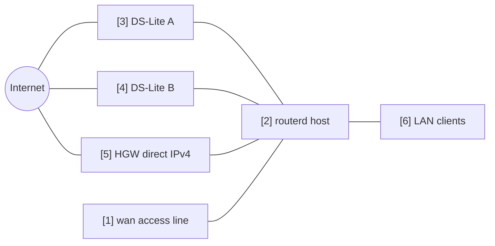

# Multi-WAN IPv4 故障切换


此示例从两个 DS-Lite tunnel 和 direct upstream-router IPv4 fallback 中选择当前使用的
IPv4 default route。完整 YAML 位于 `examples/multi-wan-home.yaml`。**该 YAML 不包含 PPPoE。**

## 架构


```mermaid
flowchart LR
  internet((Internet))
  wan["[1] wan access line"]
  router["[2] routerd host"]
  dsa["[3] DS-Lite A"]
  dsb["[4] DS-Lite B"]
  hgw["[5] HGW direct IPv4"]
  lan["[6] LAN clients"]

  internet --- dsa --- router
  internet --- dsb --- router
  internet --- hgw --- router
  wan --- router --- lan
```

| 编号 | 角色 | 实际资源 |
| --- | --- | --- |
| [1] | 所有 WAN 候选共用的物理线路 | `Interface/wan`、`DHCPv4Client/wan-dhcpv4` |
| [2] | 选择 default route | `EgressRoutePolicy/ipv4-default` |
| [3] | 第一个 DS-Lite 候选 | `DSLiteTunnel/ds-lite-a`、`HealthCheck/internet-a` |
| [4] | 第二个 DS-Lite 候选 | `DSLiteTunnel/ds-lite-b`、`HealthCheck/internet-b` |
| [5] | 上游路由器直连的最后 IPv4 fallback | `DHCPv4Client/wan-dhcpv4` |
| [6] | 通过 NAT 使用选定出口的 LAN | `NAT44Rule/lan-to-selected-wan` |

## 选择方式

选择 `weight`（优先级数字）较大且 health check 成功的候选。YAML 的实际形状如下：

```yaml
- kind: EgressRoutePolicy
  metadata:
    name: ipv4-default
  spec:
    family: ipv4
    destinationCIDRs: [0.0.0.0/0]
    selection: highest-weight-ready
    candidates:
      - name: ds-lite-a
        deviceFrom:
          resource: DSLiteTunnel/ds-lite-a
          field: device
        gatewaySource: none
        weight: 100
        healthCheck: internet-a
      - name: ds-lite-b
        deviceFrom:
          resource: DSLiteTunnel/ds-lite-b
          field: device
        gatewaySource: none
        weight: 80
        healthCheck: internet-b
      - name: hgw-direct
        deviceFrom:
          resource: Interface/wan
          field: ifname
        gatewaySource: dhcpv4
        gatewayFrom:
          resource: DHCPv4Client/wan-dhcpv4
          field: gateway
        weight: 40
```

此示例没有设置 `hysteresis`。只有观察到真实线路频繁切换且确有需要时，才按照当前 API
说明考虑添加它。

## daemon 启动前检查

```sh
LAB_DIR="$(mktemp -d)"
sudo routerd validate --config examples/multi-wan-home.yaml
sudo routerd apply --config examples/multi-wan-home.yaml --once --dry-run --skip-service-manager \
  --state-file "$LAB_DIR/state.db" \
  --ledger-file "$LAB_DIR/ledger.db" \
  --status-file "$LAB_DIR/status.json"
rm -rf "$LAB_DIR"
```

在 dry-run 中确认 `ens18`、LAN `172.18.0.0/16` 和 DS-Lite 候选名称符合你的实验环境。
如果和日常管理网络重叠，不要执行 live 操作。

## 服务启动后检查

首次安装请以可使用 `sudo` 的用户执行以下命令。若管理员通过 `routerd` 组授予本地 socket 访问，加入后必须重新登录才会生效；主机路由检查仍应保留 `sudo`。

```sh
sudo routerctl describe EgressRoutePolicy/ipv4-default
sudo ip route show default
```

本例不声明 `IPv4Route/default`。`EgressRoutePolicy` controller 会派生选定的 default
route，因此请查看 policy 的 status 和 OS 路由表。

## 操作注意事项

- health check 间隔过短可能使质量较弱的线路反复切换。
- 除非有明确意图，否则将 RFC1918 目的地排除在 NAT 和路由策略外。
- 第一次请保留控制台或独立管理 NIC。
