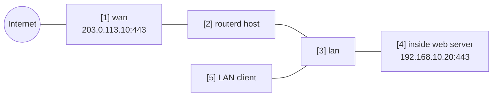

# 内部 Web 服务器的端口转发


通过 WAN 侧 IPv4 地址公开内部 HTTPS 服务器，
并启用 hairpin 让 LAN 客户端也能以相同公开名称访问的示例。

完整 YAML 位于 `examples/example-port-forward-web.yaml`。

## 构成图



## 图示对应表

| 编号 | 含义 | 主要资源 |
| --- | --- | --- |
| [1] | 外部客户端连接的公开地址与端口。 | `PortForward/web-https.spec.listen` |
| [2] | 生成（render） ingress DNAT 与 hairpin 规则的路由器。 | `PortForward/web-https` |
| [3] | hairpin 流量进入的 LAN 接口。 | `PortForward/web-https.spec.hairpin.interfaces` |
| [4] | DNAT 目的地的内部 HTTPS backend。 | `PortForward/web-https.spec.target` |
| [5] | 使用公开地址或公开 DNS 名称的 LAN 客户端。 | hairpin path |

## 要点

```yaml
# [1] 对外 listener。hairpin 时这里需要具体的 address。
- apiVersion: firewall.routerd.net/v1alpha1
  kind: PortForward
  metadata:
    name: web-https
  spec:
    listen:
      interface: wan
      address: 203.0.113.10
      protocol: tcp
      port: 443
    # [4] 接收经 DNAT 的 connection 的内部 backend。
    target:
      address: 192.168.10.20
      port: 443
    # [3] 让 LAN client 也能使用相同的对外 address。
    hairpin:
      enabled: true
      interfaces:
        - lan
```

使用 hairpin 时，需要从 LAN 侧可见的公开目的地地址。
因此请指定 `listen.address` 或 `listen.addressFrom`。

## 确认

```bash
routerctl validate -f examples/example-port-forward-web.yaml --replace
routerctl plan -f examples/example-port-forward-web.yaml --replace
routerctl describe PortForward/web-https
nft list table ip routerd_nat
```

## 常见调整项目

- 将 `203.0.113.10` 改为实际的 WAN 侧 IPv4 地址。
- DNS 请另行设置，使公开名称解析至此地址。
- 公开的端口请控制在必要最小限度。
