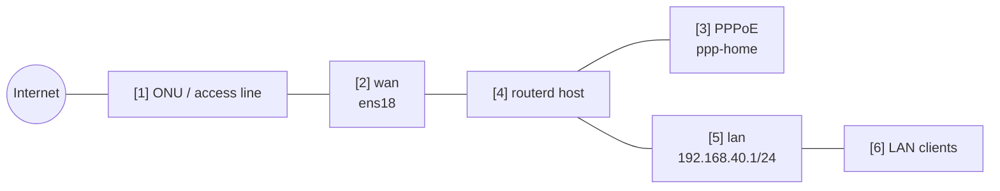

# PPPoE IPv4 NAT 路由器

物理 WAN 使用 Ethernet，通过 PPPoE 连接建立 IPv4 互联网出口的示例。

完整 YAML 位于 `examples/example-pppoe-ipv4-nat.yaml`。

## 构成图



## 图示对应表

| 编号 | 含义 | 主要资源 |
| --- | --- | --- |
| [1] | routerd 管理范围之外的 access line / ONU。 | routerd 管理外 |
| [2] | 承载 PPPoE 的物理 Ethernet 接口。 | `Interface/wan` |
| [3] | PPPoE 连接与逻辑 egress 接口。 | `PPPoESession/pppoe-home` |
| [4] | 导出 IPv4 forwarding 并应用 nftables NAT 的主机。 | Derived host runtime, `NAT44Rule/lan-to-pppoe` |
| [5] | LAN 网关与 DHCPv4 区段。 | `IPv4StaticAddress/lan-base`, `DHCPv4Server/lan-dhcpv4` |
| [6] | 通过 NAT 使用 PPPoE 作为 IPv4 互联网路由的客户端。 | `DHCPv4Server/lan-dhcpv4` |

## 本示例管理的项目

| 领域 | routerd 资源 |
| --- | --- |
| PPPoE 连接 | `PPPoESession/pppoe-home` |
| LAN 地址 / DHCPv4 | `IPv4StaticAddress/lan-base`, `DHCPv4Server/lan-dhcpv4` |
| IPv4 互联网连接 | `NAT44Rule/lan-to-pppoe` |
| 过滤 | `FirewallZone/*`, `FirewallPolicy/home` |

## 要点

```yaml
# [3] 在物理 WAN 上创建的逻辑 PPPoE interface。
- kind: PPPoESession
  metadata:
    name: pppoe-home
  spec:
    interface: wan
    ifname: ppp-home
    username: user@example.jp
    passwordFile: /usr/local/etc/routerd/secrets/pppoe-home.password
    mtu: 1454
    mru: 1454
    defaultRoute: true

# [5] -> [3] 将 LAN IPv4 traffic masquerade 到 PPPoE session 侧。
- kind: NAT44Rule
  metadata:
    name: lan-to-pppoe
  spec:
    type: masquerade
    egressInterface: pppoe-home
    sourceRanges:
      - 192.168.40.0/24
```

## 确认

```bash
routerd validate --config examples/example-pppoe-ipv4-nat.yaml
routerd apply --config examples/example-pppoe-ipv4-nat.yaml --once --dry-run
routerctl describe PPPoESession/pppoe-home
ip link show ppp-home
ip route show default
```

## 常见调整项目

- PPPoE 密码请勿直接写入 YAML，应放置于引用的 secret 文件中。
- `mtu` 与 `mru` 请依 ISP 提供的信息调整。
- 若将 PPPoE 作为备援路由，请设置 `defaultRoute: false`。
