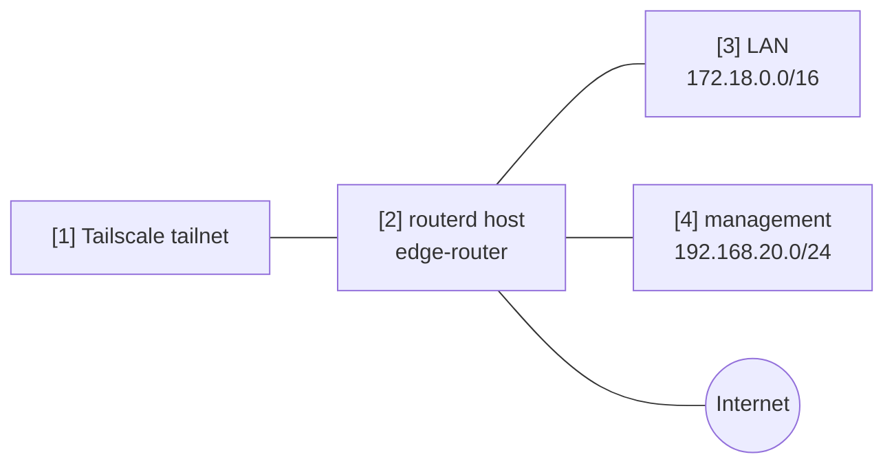

# Tailscale 子网 / 出口节点

此示例演示如何将路由器同时作为 Tailscale 的 subnet router 和 exit node 进行广播。

完整的 YAML 位于 `examples/tailscale-exit-subnet.yaml`。

## 架构图



## 图示对照表

| 编号 | 说明 | 主要资源 |
| --- | --- | --- |
| [1] | 接收路由与出口节点广播的 tailnet。 | Tailscale control plane |
| [2] | 以 Tailscale 节点身份注册的路由器。 | `TailscaleNode/home` |
| [3] | 广播至 tailnet 的 LAN 前缀。 | `advertiseRoutes` |
| [4] | 广播至 tailnet 的远端管理前缀。 | `advertiseRoutes` |

## 重点说明

```yaml
# [2] 将路由器以具名 Tailscale 节点的身份进行注册。
- apiVersion: net.routerd.net/v1alpha1
  kind: TailscaleNode
  metadata:
    name: home
  spec:
    hostname: edge-router
    advertiseExitNode: true
    # [3] + [4] 广播至 tailnet 的前缀。
    advertiseRoutes:
      - 172.18.0.0/16
      - 192.168.20.0/24
    acceptDNS: false
    authKeyEnv: TS_AUTHKEY
    authKeyFile: /usr/local/etc/routerd/secrets/tailscale.env
```

## 确认步骤

```bash
routerd validate --config examples/tailscale-exit-subnet.yaml
routerd apply --config examples/tailscale-exit-subnet.yaml --once --dry-run
routerctl describe TailscaleNode/home
tailscale status
```

请依照 tailnet 的访问策略，在 Tailscale 管理控制台端批准路由与出口节点。
