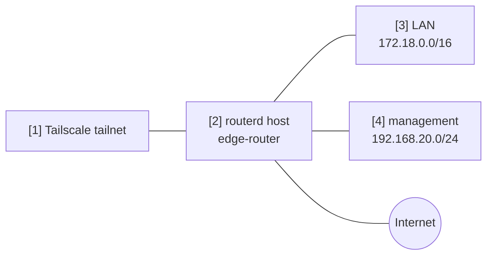

# Tailscale 子网 / 出口节点


此示例配置已安装的 Tailscale 客户端，将路由器同时作为 subnet router 和 exit node
进行广播。YAML 只有 `TailscaleNode`，并不安装 Tailscale；请先安装客户端并按 tailnet
的注册流程加入设备。

完整的 YAML 位于 `examples/tailscale-exit-subnet.yaml`。

## 架构图


```mermaid
flowchart LR
  tailnet["[1] Tailscale tailnet"]
  router["[2] routerd host<br/>edge-router"]
  lan["[3] LAN<br/>172.18.0.0/16"]
  mgmt["[4] management<br/>192.168.20.0/24"]
  internet((Internet))

  tailnet --- router
  router --- lan
  router --- mgmt
  router --- internet
```

## 图示对照表

| 编号 | 说明 | 主要资源 |
| --- | --- | --- |
| [1] | 接收路由与出口节点广播的 tailnet。 | Tailscale control plane |
| [2] | 以 Tailscale 节点身份注册的路由器。 | `TailscaleNode/home` |
| [3] | 广播至 tailnet 的 LAN 前缀。 | `advertiseRoutes` |
| [4] | 广播至 tailnet 的远端管理前缀。 | `advertiseRoutes` |

## 重点说明

```yaml
# [2] 将路由器以具名 Tailscale 节点的身份进行注册。
- apiVersion: net.routerd.net/v1alpha1
  kind: TailscaleNode
  metadata:
    name: home
  spec:
    hostname: edge-router
    advertiseExitNode: true
    # [3] + [4] 广播至 tailnet 的前缀。
    advertiseRoutes:
      - 172.18.0.0/16
      - 192.168.20.0/24
    acceptDNS: false
    authKeyEnv: TS_AUTHKEY
    authKeyFile: /usr/local/etc/routerd/secrets/tailscale.env
```

## 确认步骤

先在 daemon 未启动时进行独立检查。以下命令需要具有 `sudo` 权限的本地用户，但不会应用网络变更。

```bash
LAB_DIR="$(mktemp -d)"
sudo routerd validate --config examples/tailscale-exit-subnet.yaml
sudo routerd apply --config examples/tailscale-exit-subnet.yaml --once --dry-run --skip-service-manager \
  --state-file "$LAB_DIR/state.db" \
  --ledger-file "$LAB_DIR/ledger.db" \
  --status-file "$LAB_DIR/status.json"
rm -rf "$LAB_DIR"
```

服务运行后，才在路由器上运行 `sudo routerctl describe TailscaleNode/home` 和
`sudo tailscale status`。

请依照 tailnet 的访问策略，在 Tailscale 管理控制台端批准路由与出口节点。
