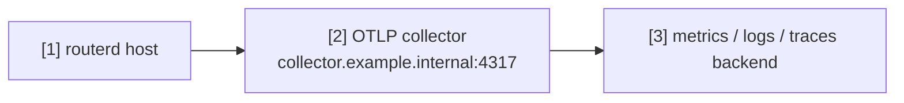

# 将遥测数据发送至 OTLP 收集器


此示例演示如何将 routerd 的遥测数据发送至 OpenTelemetry 收集器。
可用于观测长时间运行状态、健康检查、DPI 以及应用操作的延迟。

完整的 YAML 位于 `examples/telemetry-export.yaml`。

## 架构图



## 图示对照表

| 编号 | 说明 | 主要资源 |
| --- | --- | --- |
| [1] | 输出 logs、metrics、traces 的 routerd 程序。 | `Telemetry/otlp` |
| [2] | OTLP 收集器的 endpoint。 | `Telemetry.spec.otlp.endpoint` |
| [3] | 收集器转发的目标后端。 | routerd 管理范围外 |

## 重点说明

```yaml
# [1] 启用 routerd 遥测数据导出。
- apiVersion: observability.routerd.net/v1alpha1
  kind: Telemetry
  metadata:
    name: otlp
  spec:
    # [2] OTLP collector 端点。
    otlp:
      endpoint: http://collector.example.internal:4317
      insecure: true
    serviceNamespace: routerd
    attributes:
      deployment.environment: lab
      site: example
    signals:
      - logs
      - metrics
      - traces
```

## 确认步骤

```bash
routerctl validate --config examples/telemetry-export.yaml
routerctl describe Telemetry/otlp
```

请确认收集器及后端均已正确接收数据。
endpoint 应置于可信任的管理网络或专用观测网络中。
