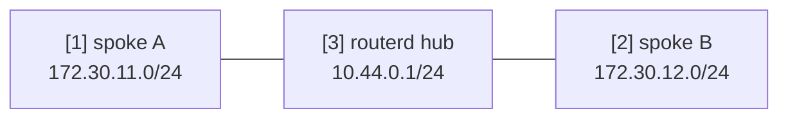

# WireGuard Hub & Spoke 模板

此为具备两个 spoke 的 routed WireGuard hub 模板。
实际使用前，请替换密钥、endpoint 及要广播的前缀。

完整的 YAML 位于 `examples/wireguard-hub-spoke.yaml`。

## 架构图



## 图示对照表

| 编号 | 说明 | 主要资源 |
| --- | --- | --- |
| [1] | spoke A 的 tunnel 地址与 routed LAN 前缀。 | `WireGuardPeer/spoke-a` |
| [2] | spoke B 的 tunnel 地址与 routed LAN 前缀。 | `WireGuardPeer/spoke-b` |
| [3] | hub 端的 WireGuard 接口与地址。 | `WireGuardInterface/wg-hub`, `IPv4StaticAddress/wg-hub-ipv4` |

## 重点说明

```yaml
# [3] hub 端 WireGuard 接口与监听端口。
- kind: WireGuardInterface
  metadata:
    name: wg-hub
  spec:
    privateKeyFile: /usr/local/etc/routerd/secrets/wg-hub.key
    listenPort: 51820
    mtu: 1420

# [1] spoke A 的 tunnel 地址与 routed LAN 前缀。
- kind: WireGuardPeer
  metadata:
    name: spoke-a
  spec:
    interface: wg-hub
    publicKey: REPLACE_WITH_SPOKE_A_PUBLIC_KEY
    allowedIPs:
      - 10.44.0.11/32
      - 172.30.11.0/24
```

## 确认步骤

```bash
routerd validate --config examples/wireguard-hub-spoke.yaml
routerd apply --config examples/wireguard-hub-spoke.yaml --once --dry-run
routerctl describe WireGuardInterface/wg-hub
wg show
```

## 常见调整项目

- 私钥请存放于限制访问权限的文件中。
- 每个 peer 须明确指定 tunnel 地址 `/32` 与 routed LAN 前缀。
- 若使用 routerd 管理 WAN 端防火墙，请一并添加 UDP 监听端口的放行规则。
