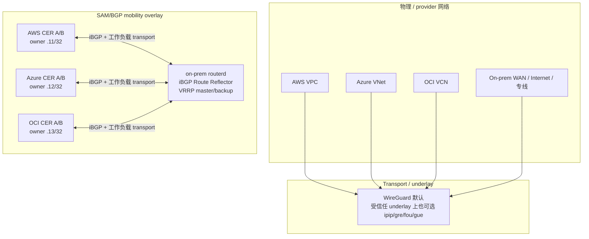
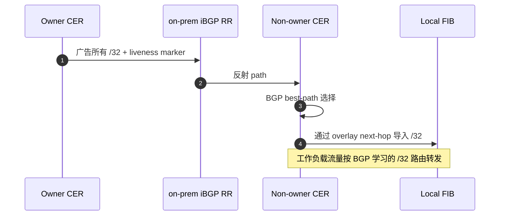
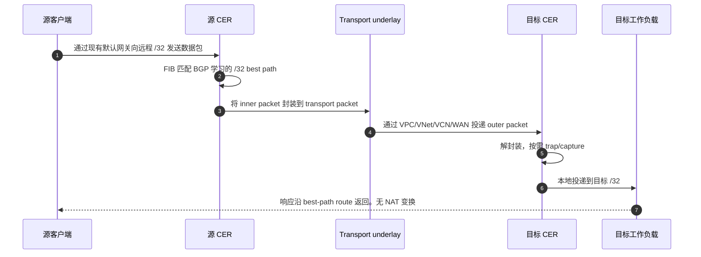
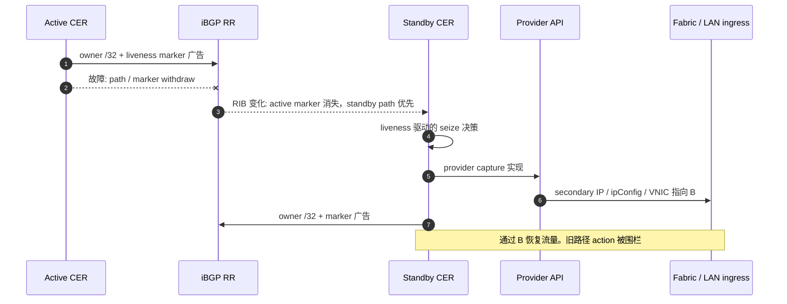
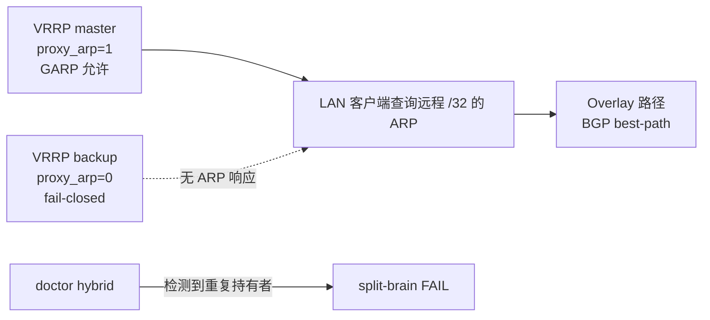

# CloudEdge Selective Address Mobility Phase G — 详细实现指南


本指南补充 Phase G 的概览，涵盖运维人员在解释和排查 CloudEdge SAM 时
需要的低层细节。

- underlay / transport / overlay 的术语梳理
- WireGuard 或 `TunnelInterface` 的封装与实际 inner/outer 数据包视图
- iBGP peer、Route Reflector 动作、BGP `/32` 所有权、liveness marker
- RIB 驱动的 trap 与 provider/on-prem capture 实现
- AWS / Azure / OCI / on-prem 的实现差异
- 常规数据平面流程、故障切换、端点的添加和删除动作

当前 Phase G 设计是 **clean Option B**。BGP 是 mobility 的唯一真实源。
之前的 mobility 专有 `AddressLease`、`ownershipEpoch`、`captureEpoch`、heartbeat、
route-lowering planner 状态已从主线删除。这些可能仍留在历史 ADR 或 Phase G
之前的讨论中，但不是描述当前 CloudEdge SAM 的主要路径。

## 1. 层次术语

CloudEdge 文档中有时将"underlay"用作 SAM/BGP mobility overlay 下层 transport
的简称。与运维人员沟通时，区分 3 个层次会很有帮助。

| 层次 | 含义 | CloudEdge SAM 中的例子 |
| --- | --- | --- |
| **物理/provider 网络** | 实际承载 outer packet 的网络。 | AWS VPC、Azure VNet、OCI VCN、on-prem WAN、Internet、DirectConnect、ExpressRoute、FastConnect。 |
| **overlay transport / underlay** | routerd 节点用于在物理/provider 网络上传输 BGP 和工作负载数据包的隧道或 transport。 | 默认 WireGuard。受信任 underlay 上可用 `TunnelInterface` mode `ipip`、`gre`、`fou`、`gue`。 |
| **SAM/BGP mobility overlay** | 逻辑的 `/32` 可达性平面。 | BGP best-path 所有权、liveness marker route、RIB trap、后台 provider capture。 |
| **工作负载数据包** | transport 内部的实际客户端/服务流量。 | `src=10.77.60.11`、`dst=10.77.60.12`、协议 TCP/UDP/NFS/RPC 等。 |

CloudEdge 文档中说"WireGuard underlay"时，请读作"SAM/BGP mobility overlay
下层的默认 transport"。不是物理 provider 网络本身。

## 2. 全局拓扑

已验证的 Phase G 演示使用 4 站点构型。

- on-prem 作为 iBGP Route Reflector hub
- AWS、Azure、OCI 的 Cloud Edge Router 通过 transport 网络与 on-prem RR 建立 peer
- 每个站点有用于本地故障切换的 active/standby 路由器
- 逻辑池内的选定地址（例如 `10.77.60.10/32` 到 `10.77.60.13/32`）作为 BGP `/32` path 广告和学习



## 3. BGP ownership plane

mobile `/32` 的所有者是该前缀当前的 BGP best path。
运维人员无需手动记述 lease、claim 或每地址的 provider action。
routerd 将 `MobilityPool` 的意图投影为 BGP 广告，观测 RIB 来判断本地
应实现什么。



要点:

- 所拥有的服务/客户端地址是普通 IPv4 unicast `/32` 广告
- marker route 表示节点的 liveness，与所有 `/32` 分开
- route policy 和 community 表达优先级与身份
- BGP RIB/FIB 状态是数据平面使用的所有者视图
- provider capture action 以当前 BGP mobility path signature 围栏

## 4. 封装: 实际数据包视图

当某站点向远程 owner `/32` 发送流量时，客户端数据包
不做 NAT。它成为 transport 承载的 **inner packet**。

例: AWS 客户端 `.11` 与 Azure owner `.12` 通信。

```text
inner 工作负载数据包:
  src = 10.77.60.11
  dst = 10.77.60.12
  proto = TCP/22, NFS, RPC, FTP, bulk TCP 等

transport 封装:
  WireGuard / GRE / IPIP / FOU / GUE 包裹 inner packet。

outer transport 数据包:
  src = AWS CER 的 transport/underlay IP
  dst = Azure CER 的 transport/underlay IP
  proto = WireGuard 为 UDP/51820、GRE、IPIP、UDP-encap 等

物理/provider 网络:
  AWS VPC / WAN / Azure VNet 投递 outer packet。
```

接收端 CER:

1. transport 数据包被解封装。
2. inner packet 仍为 `src=10.77.60.11`、`dst=10.77.60.12`。
3. 目标站点通过 capture 的 `/32` path 本地投递。
4. 响应流量沿相同 overlay/BGP 决策路径反向行进。

## 5. 各环境的 capture 实现

BGP 决定可达性。provider 或 on-prem capture 使选定的 `/32`
在正确的边缘物理或本地可达。

| 环境 | capture 方法 | 控制/API | 故障切换动作 | 注意 |
| --- | --- | --- | --- | --- |
| AWS | ENI secondary private IP | allow-reassignment 动作的 `assign-private-ip-addresses` | active 的 marker/path 消失后 standby 夺取 secondary IP。 | 确保 ENI 权限和 source/dest check 行为一致。 |
| Azure | NIC secondary IP（via ipConfig） | 删除旧持有者的 ipConfig，创建新持有者的 ipConfig | 2 步 remove/add。重试需处理部分故障。 | IP 持有 NIC 暂时不存在的短窗口。executor 需幂等。 |
| OCI | VNIC secondary private IP | `assign-private-ip --unassign-if-already-assigned` | standby 将 private IP 再分配到自身 VNIC。 | 验证 VNIC/private-IP 状态、forwarding 和本地防火墙。 |
| On-prem | proxy ARP + GARP | 由 VRRP/CARP 样的 mastership 门控的 OS 网络，或对单站点/单路由器/单 owner 的 lab 使用 `capture.activeWhen.type: single-router` | HA 对使用 VRRP master 门控。单路由器站点可选无 VRRP 的常时 active capture。 | 防止重复 ARP 响应。split-brain doctor 必须大声失败。 |

provider secondary IP 的 reconciliation 是后台 fabric-ingress 实现。
对云原生入口路径很重要，但不得成为 overlay 可达性的真实源。

## 6. 常规通信序列



应通过数据包捕获证明的不变量:

- 客户端的默认网关未变化
- 服务端能看到原始源 `/32`
- 不出现 NAT 变换签名
- 仅选定的 `/32` 目标被 CloudEdge SAM 吸收
- bulk/protocol 测试不因 MTU/PMTU 产生黑洞

## 7. 云端故障切换序列



各 provider 动作:

- AWS: 将 secondary private IP 再分配到 standby ENI。
- Azure: 删除旧 ipConfig，在 standby NIC 创建新 ipConfig。
- OCI: `--unassign-if-already-assigned` 将 private IP 再分配到 standby VNIC。
- On-prem: VRRP master 转换使仅新 master 启用 proxy ARP/GARP。

## 8. On-prem 的 LAN capture 与 split-brain 安全性

BGP 能决定远程 overlay 路径，但仅靠它不能保护本地 L2 ARP 权限。
因此 on-prem capture 在本地门控。



规则:

- 仅 master 对 capture 的 `/32` 地址以 proxy ARP 响应
- backup 即使持有相同的声明式意图也保持 fail-closed
- master 转换时发送 GARP 以刷新 LAN 缓存
- 单站点/单路由器/单 owner 构型中，`capture.activeWhen.type: single-router` 是无 VRRP 门控的显式常时 active proxy-ARP capture 模式
- 重复 proxy ARP 持有者是硬性诊断失败

## 9. 端点的添加/删除与路由传播

关键消息传播是 BGP 的 advertise/withdraw，而非 mobility 专有的
lease/heartbeat 传播。

### 新增或恢复的 `/32`

1. 本地 owner 变为 eligible，广告所有 `/32` 和 marker。
2. RR 将路由反射到云端/on-prem peer。
3. peer 将 best path 导入本地 FIB。
4. RIB trap 按需触发 provider/on-prem capture reconciliation。
5. 数据平面开始向新 owner path 转发。

### 删除或移动的 `/32`

1. 旧 owner withdraw `/32` 或 marker 消失。
2. BGP best path 变化或消失。
3. path-signature fencing 使 stale provider action 被跳过。
4. 新持有者广告并实现 capture。
5. 所有 peer 收敛到新 FIB 路由或释放状态。

## 10. PMTU 与协议透明性

封装增加了开销。因此 CloudEdge 将 PMTU/MSS 视为
数据平面不变量，而非可选诊断项。

- `EstimateMTU` 跟随 WireGuard 或 `TunnelInterface` 的开销。
- `routerd_mss` 钳制 TCP MSS 以避免黑洞。
- 受信任路径上，当 DF 黑洞缓解比保持 DF 语义更重要时，可用 IPv4 force-fragment。
- 协议透明性 acceptance 应包含 ping 之外的 FTP active/passive、NFS、RPC/rpcbind、大容量 TCP bulk、DF/no-DF PMTU 探测。

## 11. 运维检查清单

解释或调试 CloudEdge SAM 时，按此清单依次确认。

1. 当前 BGP best path owner 持有哪些 `/32`？
2. 承载 iBGP 会话和工作负载数据包的 transport 是什么？
3. 能否分别观测 inner 和 outer 数据包？
4. non-owner CER 是否将 `/32` 的 best path 导入了 FIB？
5. provider/on-prem capture 是否以正确权限执行？
6. stale provider action 是否被当前 BGP path signature 围栏？
7. on-prem backup 是否 fail-closed，split-brain doctor 是否干净？
8. 数据包捕获是否证明了 source 保持和 NAT 无？
9. MSS/PMTU 探测和 bulk 协议是否通过？

## 12. 面向人类的简短说明

CloudEdge SAM 是 BGP best-path 驱动的 `/32` mobility。routerd 以 WireGuard 等
transport underlay 连接站点，通过 iBGP 学习和广告选定 `/32` 的 owner，
trap RIB 变化，以 provider secondary IP 或 on-prem proxy ARP/GARP 实现 ingress，
以 NAT 无方式传输工作负载数据包，因此源 IP 和客户端的
默认网关行为不变。
