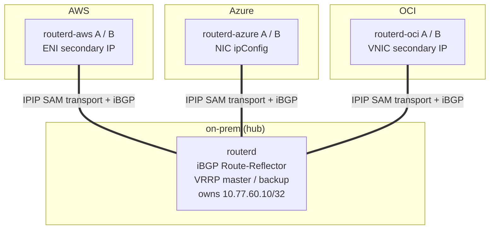
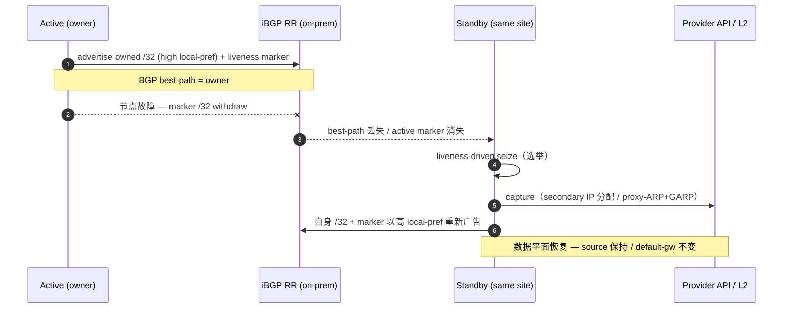
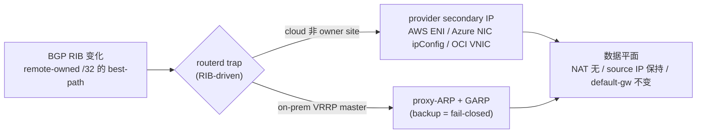
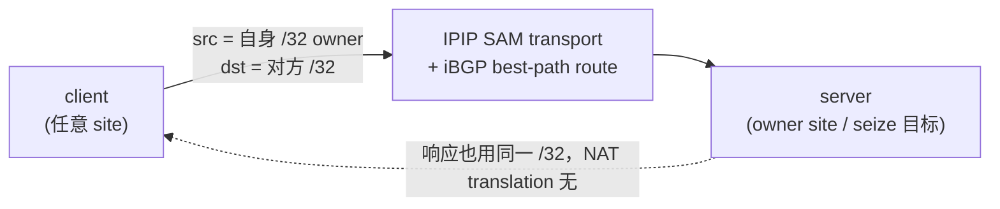
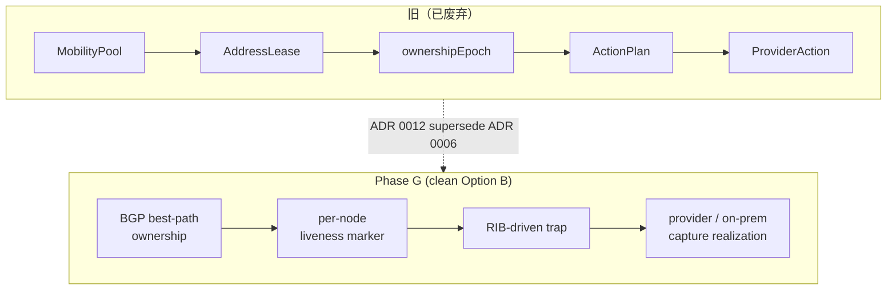

# CloudEdge Selective Address Mobility (Phase G) — 说明图

CloudEdge SAM Phase G 跨 AWS / Azure / OCI / on-prem 使选定的 `/32`
服务/客户端地址以 **NAT 无、source IP 保持、default gateway 不变**的方式
可达，并在路由器节点故障时由同一站点的 standby 自主获取所有权，
恢复 L3 可达性。

设计的核心是 **clean Option B**:

- **ownership = BGP best-path** — `/32` 的所有者由 BGP 最优路径决定（无中央锁或
  lease/epoch 的单一真实源）。
- **liveness = per-node marker** — 每个节点广告 overlay `/32` + identity community 的
  marker。active marker 消失即触发 failover。
- **trap = RIB-driven** — RIB 变化（remote-owned `/32` 的 best-path）由 routerd trap。
- **seize = liveness-driven** — active marker 消失后同一站点的 standby seize。

---

## 1. 拓扑 — SAM transport + iBGP hub-spoke

每个站点的 routerd 在 `SAMTransportProfile` 生成的 IPIP transport 上建立 iBGP，
以 on-prem Route-Reflector(RR) 为 hub 的 hub-spoke 构型。需要加密的环境中
WireGuard 作为 endpoint 专用 underlay 铺设在下方。

- 逻辑 `/24` = `10.77.60.0/24`。每个站点的 owner `/32`（例如 on-prem `.10` / AWS `.11`
  / Azure `.12` / OCI `.13`）从所有站点均可达。
- 默认投递为 IPIP。使用 WireGuard 时 `AllowedIPs` 仅限 transport endpoint
  prefix，mobile `/32` 由 BGP 和 FIB 处理。

---

## 2. 所有权与自主故障切换

active 以高 local-pref 广告所有 `/32` 和 liveness marker。节点故障导致 marker
withdraw 后，同一站点的 standby **零手动操作**seize。

实测收敛时间（acceptance）: AWS 16.9s / Azure 56.7s / OCI seize / **on-prem VRRP 8s**，
全部 `manualProviderAction=false`（自主）。目标 60s 以下。

---

## 3. capture 的实现 — 从 trap 到各 provider / on-prem

trap RIB 的 best-path 变化，云端通过 provider secondary IP，on-prem 通过
VRRP-master gated 的 proxy-ARP + GARP 捕获 `/32`。

- on-prem 是 **VRRP-master hard-gate**: 仅 master 对 proxy-ARP/GARP 做出响应，backup
  fail-closed（`proxy_arp=0`，不响应 ARP）。`routerctl doctor hybrid` 对 split-brain
  确定性 FAIL（设计上无环路）。
- cloud capture 的 provider mutation 以最小权限 identity（AWS ENI-scoped / OCI compartment /
  Azure custom role）自主执行。

---

## 4. 数据平面不变量

- **NAT 无** — 不出现 translation 签名（tcpdump 确认）。
- **source IP 保持** — server 看到的 source 是 client 的 `/32`。
- **default gateway 不变** — client 的默认路由不改变。
- **MTU/PMTU** — 跟随 overlay 有效 MTU 做 MSS clamp(`routerd_mss`)，必要时
  IPv4 force-fragment(P2-b, ADR 0013, 默认关闭)回避 DF blackhole。
- 透明性 acceptance: FTP(active/passive) / NFS / RPC(rpcbind) / 100MB bulk
  无 fragment/blackhole 完走（source 保持、no-NAT 确认）。

---

## 5. 与旧模型的对比

撤除了多个真实源（lease / epoch / heartbeat / action journal）交织的复杂度，
**BGP 作为唯一的 ownership plane**，使网络解释更简明、更健壮。

---

## 相关

- ADR 0012: BGP /32 Address Mobility（clean Option B）
- ADR 0009: Pluggable Overlay Underlay（ipip/gre/fou/gue）
- ADR 0013: IPv4 Force Fragmentation
- reference: Selective Address Mobility
- how-to: cloudedge-mobility-demo / cloudedge-autonomous-lab
- 幻灯片: `docs/slides/cloudedge-sam-phase-g.md`
