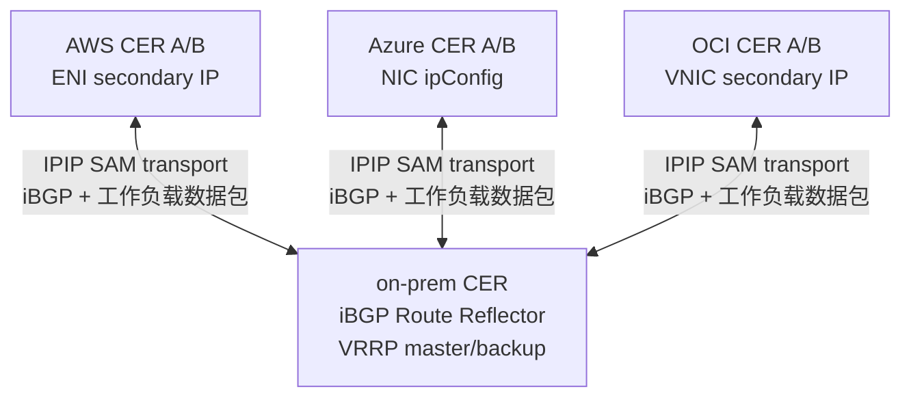
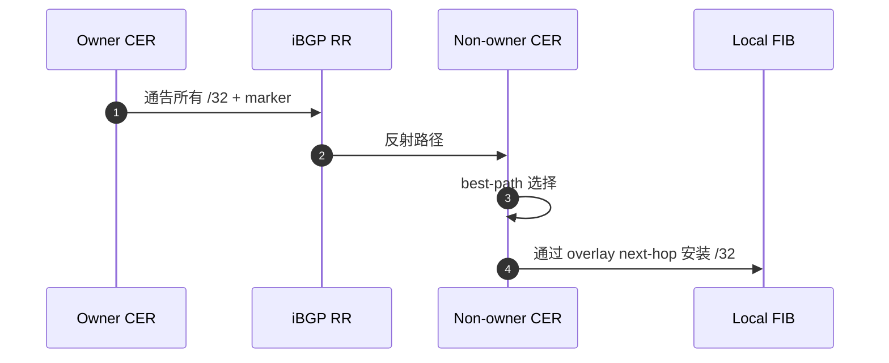
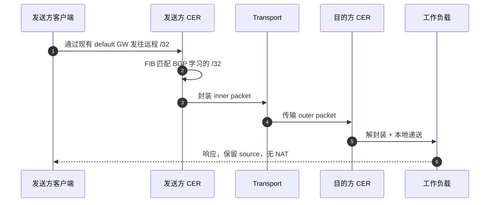
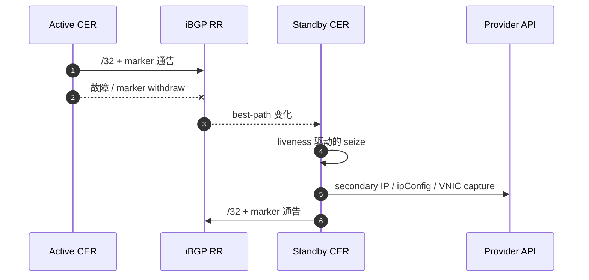
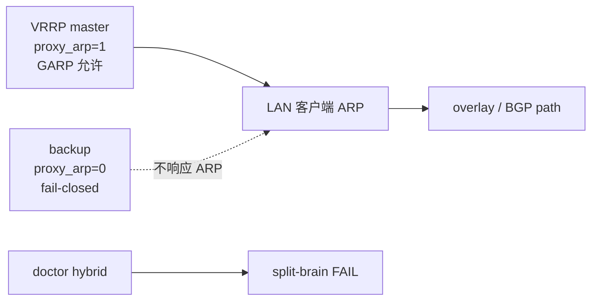

# CloudEdge SAM Phase G 详细解析
## underlay / transport / overlay / BGP / 数据包 / secondary IP

跨 AWS / Azure / OCI / on-prem 的 BGP best-path 驱动的 `/32` mobility

**无 NAT / 保留源 IP / default gateway 不变**

---

## 1. 对齐各层

| 层 | 角色 | 示例 |
|---|---|---|
| physical/provider network | 实际传输 outer packet | AWS VPC / Azure VNet / OCI VCN / WAN / Internet |
| transport / underlay | 承载 SAM/BGP overlay 的底层 | IPIP/GRE tunnel，需要时使用 endpoint-only WireGuard underlay |
| SAM/BGP mobility overlay | 决定 `/32` owner 和 delivery | BGP best-path / marker / RIB trap |
| workload packet | 终端和服务的实际通信 | src/dst 保持 `/32` 不变 |

> CloudEdge 文档中所称的 "underlay"，有时指从 SAM overlay 视角看的底层 transport。

---

## 2. 4 站点拓扑



- logical pool：`10.77.60.0/24`
- 选定 owner：`.10` on-prem、`.11` AWS、`.12` Azure、`.13` OCI
- 非完全 L2 extension，而是通过 BGP 使选定的 `/32` 可达

---

## 3. BGP ownership plane

| 要素 | 方式 |
|---|---|
| ownership | BGP best-path |
| liveness | per-node marker route + identity community |
| delivery | 通过 BGP 学习的 `/32` FIB route |
| trap | RIB 驱动的 best-path 变化 |
| provider capture | 从 BGP path view 进行的后台 reconciliation |

`AddressLease / ownershipEpoch / captureEpoch / heartbeat` 已从主线移除，
BGP RIB 成为 mobility 的唯一真实源。

---

## 4. BGP 路径传播



需要确认的内容：

- GoBGP RIB / Adj-RIB-Out
- route policy / local-pref / community
- marker path 的存在
- OS FIB 中的 `/32` route

---

## 5. 封装：inner 与 outer

```text
inner 工作负载数据包：
  src = 10.77.60.11
  dst = 10.77.60.12

transport：
  IPIP / GRE TunnelInterface
  端点加密可选用 WireGuard underlay

outer 数据包：
  src = 发送方 CER 的 transport IP
  dst = 目的方 CER 的 transport IP
```

要点：

- inner 的 src/dst 不做 NAT
- 只有 outer packet 在 physical/provider network 上传输
- tcpdump 需区分 inner/outer 的观测点

---

## 6. capture 实现

| 环境 | capture | API / 实现 | failover |
|---|---|---|---|
| AWS | ENI secondary private IP | assign-private-ip-addresses | allow-reassignment |
| Azure | NIC ipConfig secondary IP | 删除旧 ipConfig + 新建 | 2 步重试 |
| OCI | VNIC secondary private IP | assign-private-ip | unassign-if-already-assigned |
| on-prem | proxy ARP / GARP | OS networking + VRRP 门控 | 仅 master，backup 为 fail-closed |

BGP best-path 决定 owner。secondary IP / ARP 实现 ingress。
单一 on-prem 路由器配置下，可通过 `capture.activeWhen.type: single-router` 选择无 VRRP 的常时 capture。

---

## 7. 正常数据包流



---

## 8. 云端故障切换序列



- stale 的路径 action 使用当前 BGP path signature 进行 fencing
- overlay 可达性可在 provider fabric 追赶完成前恢复

---

## 9. On-prem VRRP / proxy ARP 的安全性



- BGP 不替代本地 L2/ARP 权限
- 仅 master 实现 proxy ARP / GARP
- backup 保持 fail-closed
- single-router capture 是面向 1 站点 / 1 路由器 / 1 owner 的显式模式
- 重复 proxy-ARP 持有者是诊断故障

---

## 10. 端点的添加和删除

### 新增 `/32`
1. owner 通告 `/32` + marker
2. RR 反射路径
3. non-owner 导入 FIB route
4. RIB trap 触发 capture reconciliation
5. 开始转发流量

### 删除或移动的 `/32`
1. 旧 owner withdraw 路径或 marker 消失
2. best path 变化
3. stale 的 provider action 被跳过
4. 新持有者通告并 capture
5. 对等方收敛

---

## 11. PMTU 与协议透明性

- 封装开销会改变实际 MTU
- `routerd_mss` 通过 TCP MSS clamp 避免黑洞
- IPv4 force-fragment 用于可信路径，默认关闭
- acceptance 应包含的项目：
  - FTP active/passive
  - NFS
  - RPC / rpcbind
  - 100MB 批量传输
  - DF / no-DF PMTU 探测
  - 通过 tcpdump 确认 source 保留 / 无 NAT

---

## 12. 讲解检查清单

1. 当前 BGP best-path owner 拥有哪些 `/32`？
2. 承载 iBGP 和工作负载数据包的 transport 是什么？
3. 在哪里可以观测 inner 和 outer 的数据包头？
4. 本地 FIB 是否已导入远程 `/32`？
5. 实现 ingress 的 provider/on-prem capture 机制是哪个？
6. stale 的 action 是否使用 path signature 进行了 fencing？
7. 数据包捕获是否证明了无 NAT 和 source 保留？

CloudEdge SAM = **BGP best-path driven `/32` mobility**。
