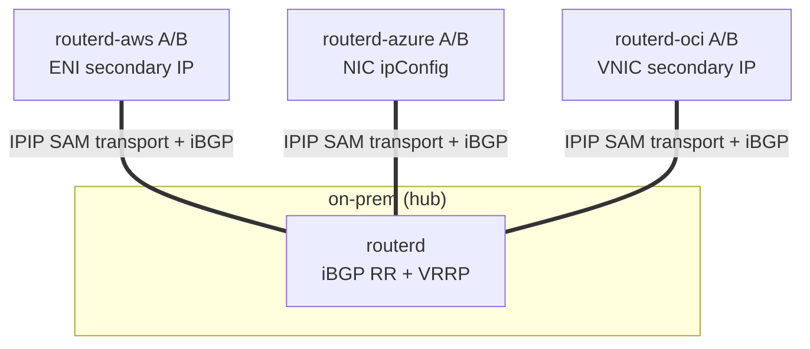
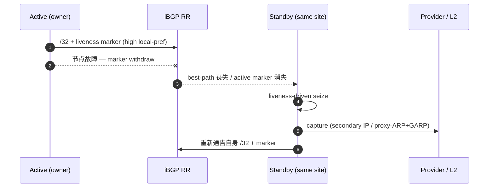
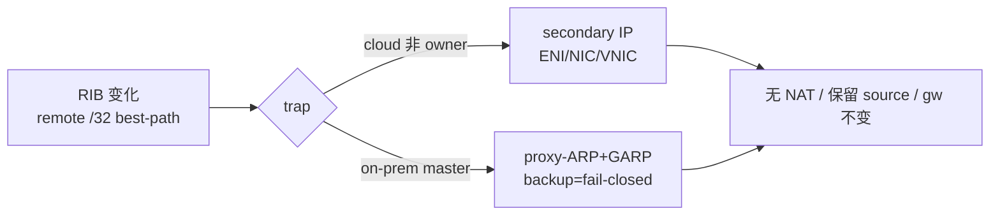

<!--
Marp 幻灯片。渲染示例：
  npx @marp-team/marp-cli docs/slides/cloudedge-sam-phase-g.md -o cloudedge-sam-phase-g.html
  npx @marp-team/marp-cli docs/slides/cloudedge-sam-phase-g.md --pdf
在 docusaurus 中也可作为普通 Markdown 页面阅读（--- 渲染为分隔线）。
-->

# CloudEdge Selective Address Mobility
## Phase G — 自主 BGP `/32` 地址移动性

跨 AWS / Azure / OCI / on-prem 的 `/32` 可移植性
**无 NAT、保留源 IP、default gateway 不变**

routerd Cloud Edge Router

---

## 课题

- 在多云 + 本地部署环境中，需要在站点间使同一 `/32`（服务/客户端地址）可达。
- 路由器节点故障时，需要**零手动操作**由同一站点的 standby 接管，
  恢复 L3 可达性。
- 需要以**统一框架**处理 provider 特定的操作（AWS secondary IP /
  Azure NIC ipConfig / OCI VNIC / on-prem VRRP）。
- 防止 split-brain / flapping，目标收敛时间**低于 60s**。

---

## 设计 — clean Option B

| 要素 | 方式 |
|---|---|
| **ownership** | BGP best-path（唯一真实源） |
| **liveness** | per-node marker（overlay `/32` + identity community） |
| **trap** | RIB-driven（捕获 best-path 变化） |
| **seize** | liveness-driven（active marker 消失时 standby 获取） |

撤除旧有的 **AddressLease / ownershipEpoch / heartbeat / ActionPlan**。
排除多个真实源，将 BGP 作为唯一的 ownership plane。

-> ADR 0012 supersede ADR 0006

---

## 拓扑 — SAM transport + iBGP hub-spoke

logical `/24` = `10.77.60.0/24` / 默认 delivery 为 IPIP，需要加密时使用 endpoint-only WireGuard underlay

---

## 自主故障切换

零手动操作、`manualProviderAction=false`

---

## capture 的实现

- on-prem：**VRRP-master 硬门控** — backup 为 fail-closed（`proxy_arp=0`）
- doctor hybrid 确定性地判定 split-brain 为 FAIL（设计上无循环）
- 云端变更以**最小权限 identity** 自主执行

---

## 数据平面不变条件

- **无 NAT** — 不产生 translation signature
- **保留源 IP** — 服务器看到的 source = 客户端的 `/32`
- **default gateway 不变** — 客户端的默认路由不变
- **MTU/PMTU** — overlay 追随的 MSS clamp（`routerd_mss`）+ 可选的 IPv4
  force-fragment（默认关闭）避免 DF blackhole

-> FTP(active/passive) / NFS / RPC / 100MB bulk 无 fragment 完成

---

## transport 与 PMTU

- **SAMTransportProfile**
  - 默认 delivery 为 IPIP `TunnelInterface`
  - WireGuard 为 endpoint `/32` 专用 underlay。mobile `/32` 不加入 `AllowedIPs`
- **P2-b — IPv4 force-fragment**（ADR 0013）
  - `OverlayPeer / TunnelInterface.pathMTU.forceFragmentIPv4`，默认关闭
  - 缓解低 PMTU underlay 的 DF blackhole（仅限 IPv4）

---

## acceptance 结果（实机 evidence）

| 项目 | 结果 |
|---|---|
| overall | **overallPass: true** |
| 4-site matrix | D3 **12/12** |
| AWS / Azure / OCI failover | D5 / D6 56.7s / D7（自主, 60s 以下） |
| on-prem VRRP | D8 recovery **8s**, backup fail-closed, split-brain FAIL |
| L2 loop / STP | recovery 3s, STP blocking, loop-free |
| 协议透明性 | FTP/NFS/RPC/100MB/PMTU/source 保留/no-NAT 全 PASS |
| 最小权限 | AWS / OCI / Azure scoped identity 实证 |
| unit | go test **2322 pass** |

---

## 总结

- **BGP best-path 决定 `/32` 的 owner**
- **CER trap RIB 变化**
- **云端通过 secondary IP，on-prem 通过 proxy-ARP/GARP 实现**
- **数据平面不做 NAT，维持源 IP 和 default gateway**

CloudEdge SAM = *BGP best-path driven `/32` mobility*

兼具网络工程师能理解的简洁性和实机 acceptance 验证的稳健性。
