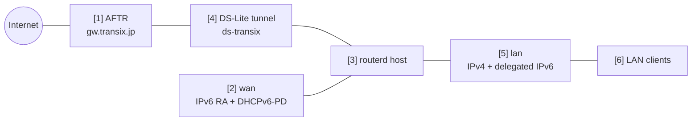

# DS-Lite 家用路由器


這是以 IPv6 作為主要線路的連線範例。路由器透過 Router Advertisement 和 DHCPv6-PD 取得 IPv6，
衍生 LAN 前綴，並將 IPv4 流量通過 DS-Lite 通道傳送。

完整的已驗證 YAML 位於 `examples/example-dslite-home.yaml`。

## 架構圖



## 圖示對應表

| 編號 | 說明 | 主要資源 |
| --- | --- | --- |
| [1] | DS-Lite 通道連線目標的 ISP 端 AFTR。 | `DSLiteTunnel/transix` |
| [2] | 接收 IPv6 RA 和 DHCPv6-PD 的 WAN 介面。 | `DHCPv6PrefixDelegation/wan-pd` |
| [3] | 建立通道和 LAN 服務、並推導所需 sysctl 的 routerd 主機。 | Derived host runtime |
| [4] | 用於 IPv4 egress 的 DS-Lite `ip6tnl` 裝置。 | `DSLiteTunnel/transix`，從 trust/untrust 區域自動推導的 NAT44 |
| [5] | 持有 IPv4 位址和委派 IPv6 位址的 LAN 介面。 | `IPv4StaticAddress/lan-ipv4`、`IPv6DelegatedAddress/lan-ipv6` |
| [6] | 接收 DHCPv4、RA、RDNSS、DNSSL 的 LAN 用戶端。 | `DHCPv4Server/lan-dhcpv4`、`IPv6RouterAdvertisement/lan-ra` |

## 此範例管理的項目

| 領域 | routerd 資源 |
| --- | --- |
| WAN IPv6 | `DHCPv6PrefixDelegation/wan-pd` |
| 前綴委派（PD） | `DHCPv6PrefixDelegation/wan-pd`、`IPv6DelegatedAddress/lan-ipv6` |
| DS-Lite | `DSLiteTunnel/transix` |
| LAN IPv4 和 DHCPv4 | `IPv4StaticAddress/lan-ipv4`、`DHCPv4Server/lan-dhcpv4` |
| LAN IPv6 廣播 | `IPv6RouterAdvertisement/lan-ra` |
| DNS | `DNSZone/home`、`DNSResolver/lan-resolver` |
| IPv4 egress | 從 trust/untrust 區域自動推導的 NAT44 |
| MTU/MSS | 從 `DSLiteTunnel/transix` 和防火牆區域自動推導 |

此範例使用近似 Transix 的 AFTR 值作為預留位置。請依照實際線路替換
AFTR FQDN、DNS 伺服器，以及 DHCPv6 用戶端的 profile。

## 設定重點

```yaml
# [2] 從 WAN 取得 IPv6 前綴委派（PD）。
- apiVersion: net.routerd.net/v1alpha1
  kind: DHCPv6PrefixDelegation
  metadata:
    name: wan-pd
  spec:
    interface: wan
    client: dhcp6c
    profile: ntt-hgw-lan-pd

# [5] 從委派前綴衍生 LAN IPv6 位址。
- apiVersion: net.routerd.net/v1alpha1
  kind: IPv6DelegatedAddress
  metadata:
    name: lan-ipv6
  spec:
    prefixDelegation: wan-pd
    interface: lan
    subnetID: "0"
    addressSuffix: "::1"

# [1] + [4] 建立指向 ISP AFTR 的 DS-Lite 通道。
- apiVersion: net.routerd.net/v1alpha1
  kind: DSLiteTunnel
  metadata:
    name: transix
  spec:
    interface: wan
    tunnelName: ds-transix
    aftrFQDN: gw.transix.jp
    aftrDNSServers:
      - 2404:1a8:7f01:a::3
      - 2404:1a8:7f01:b::3
    localAddressSource: delegatedAddress
    localDelegatedAddress: lan-ipv6
    localAddressSuffix: "::100"
    defaultRoute: true
    mtu: 1454
```

此 DS-Lite 通道以委派的 IPv6 位址作為本地端點。
若線路端預期以 WAN RA 位址作為端點，請將 `localAddressSource` 改為
`interface`。

## LAN 端服務

此範例透過 RA 廣播委派的前綴，並向用戶端分發路由器作為 DNS。

```yaml
# [6] 透過 RA 廣播委派的 LAN 前綴和本地 DNS 資訊。
- apiVersion: net.routerd.net/v1alpha1
  kind: IPv6RouterAdvertisement
  metadata:
    name: lan-ra
  spec:
    interface: lan
    prefixFrom:
      resource: IPv6DelegatedAddress/lan-ipv6
      field: address
    rdnssFrom:
      - resource: IPv6DelegatedAddress/lan-ipv6
        field: address
    dnsslFrom:
      - resource: DNSZone/home
        field: zone
    oFlag: true
    mtu: 1454
```

`DNSResolver` 中設定了針對 AFTR 名稱的條件式轉送器。在 AFTR 記錄只在線路端解析器才有意義的設定中，此指定至關重要。

## 套用步驟

```bash
cp examples/example-dslite-home.yaml router.yaml
routerctl validate -f router.yaml --replace
routerctl plan -f router.yaml --replace
```

執行 plan 時請確認以下項目。

- WAN / LAN 的介面名稱正確。
- 不會誤刪管理存取路徑。
- AFTR FQDN 和解析器位址為預期的值。
- NAT 出口為 DS-Lite 通道而非實體 WAN。

確認無誤後執行套用。

```bash
routerctl apply -f router.yaml --replace
```

## 確認

```bash
routerctl status
routerctl describe DHCPv6PrefixDelegation/wan-pd
routerctl describe IPv6DelegatedAddress/lan-ipv6
routerctl describe DSLiteTunnel/transix
routerctl describe FirewallZone/wan
ip -6 tunnel show
ip route show default
```

在 LAN 用戶端端確認以下項目。

```bash
ip -6 addr
ip route
curl https://1.1.1.1/
dig router.home.example
```

## 常見的修改點

- 依照平台變更 `client` 和 `profile`。
- 非 Transix 的場合，請替換 `gw.transix.jp` 和 AFTR 解析器位址。
- 若需從 WAN RA 位址建立 DS-Lite 通道，請使用 `localAddressSource: interface`。
- DS-Lite 通常需要 MSS clamp。routerd 會從通道 MTU 和 LAN/WAN 的防火牆區域自動推導。
