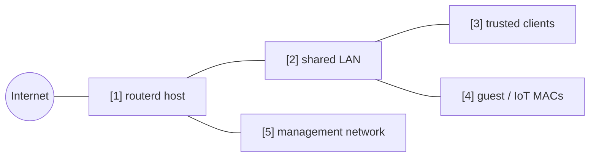

# 訪客 / IoT 端點隔離


將連接至同一 LAN 的特定 MAC 位址視為訪客 / IoT 端點，
允許其存取網際網路，但阻止其到達受信任的 LAN 及管理網路的範例。

完整 YAML 位於 `examples/guest-mode.yaml`。

## 構成圖



## 圖示對應表

| 編號 | 含義 | 主要資源 |
| --- | --- | --- |
| [1] | 套用端點策略的路由器。 | `FirewallPolicy/default` |
| [2] | 受信任端點與訪客端點共存的共用 LAN。 | `FirewallZone/lan` |
| [3] | 不符合訪客策略的一般端點。 | default zone behavior |
| [4] | 視為訪客 / IoT 的 MAC 位址。 | `ClientPolicy/guest-devices` |
| [5] | 訪客端點不得到達的管理目的地。 | `ClientPolicy.spec.isolation.lanMgmt` |

## 要點

```yaml
# [4] 將列出的 MAC address 視為隔離的 guest / IoT client。
- apiVersion: firewall.routerd.net/v1alpha1
  kind: ClientPolicy
  metadata:
    name: guest-devices
  spec:
    mode: include
    macs:
      - 18:ec:e7:33:12:6c
    # [4] -> [1] 允許 internet，拒絕 LAN 與管理網路。
    isolation:
      lanInternet: allow
      lanLAN: deny
      lanMgmt: deny
      mDNSBroadcast: deny
```

## 確認

```bash
routerd validate --config examples/guest-mode.yaml
routerd apply --config examples/guest-mode.yaml --once --dry-run
routerctl describe ClientPolicy/guest-devices
nft list table inet routerd_filter
```

確認訪客端點可以連出網際網路，但無法到達受信任的 LAN 與管理網路。

## 常見調整項目

- 僅隔離列舉的 MAC 位址時，使用 `mode: include`。
- 原則上視為訪客，僅列舉的端點視為受信任時，使用 `mode: exclude`。
- 為在 Web 管理介面中更易於識別，可搭配 DHCP 保留位址一起設定。
