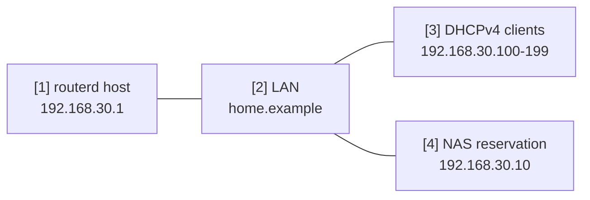

# LAN DHCP 與本地 DNS


將單一 LAN 介面作為小型家用 LAN 或驗證用 LAN 服務區段的範例。
routerd 管理 LAN 位址、DHCPv4、本地 DNS 區域，以及 DHCP 租約衍生的名稱。

完整 YAML 位於 `examples/example-lan-dns-dhcp.yaml`。

## 構成圖



## 圖示對應表

| 編號 | 含義 | 主要資源 |
| --- | --- | --- |
| [1] | 同時負責 LAN DNS 監聽的路由器位址。 | `IPv4StaticAddress/lan-base`, `DNSResolver/lan-resolver` |
| [2] | 作為 DHCP search domain 發送的本地 DNS 區域。 | `DNSZone/home` |
| [3] | 接收位址與 DNS 設定的動態用戶端。 | `DHCPv4Server/lan-dhcpv4` |
| [4] | 具有固定租約與名稱的基礎設施主機。 | `DHCPv4Reservation/nas`, `DNSZone/home` |

## 本範例管理的項目

| 領域 | routerd 資源 |
| --- | --- |
| LAN 位址 | `Interface/lan`, `IPv4StaticAddress/lan-base` |
| 本地名稱 | `DNSZone/home` |
| 解析器 | `DNSResolver/lan-resolver` |
| DHCPv4 | `DHCPv4Server/lan-dhcpv4`, `DHCPv4Reservation/nas` |

## 要點

```yaml
# [2] router.home.example 或 nas.home.example 的本地區域。
- kind: DNSZone
  metadata:
    name: home
  spec:
    zone: home.example
    dhcpDerived:
      sources:
        - DHCPv4Server/lan-dhcpv4
      ddns: true

# [3] 透過 DHCP 將 router address 作為 gateway / DNS 發放。
- kind: DHCPv4Server
  metadata:
    name: lan-dhcpv4
  spec:
    gatewayFrom:
      resource: IPv4StaticAddress/lan-base
      field: address
    dnsServerFrom:
      - resource: IPv4StaticAddress/lan-base
        field: address
    domainFrom:
      resource: DNSZone/home
      field: zone
```

## 確認

```bash
routerd validate --config examples/example-lan-dns-dhcp.yaml
routerd apply --config examples/example-lan-dns-dhcp.yaml --once --dry-run
routerctl describe DNSZone/home
routerctl describe DHCPv4Server/lan-dhcpv4
dig @192.168.30.1 router.home.example
```

## 常見調整項目

- 將 `home.example` 改為您自己的 search domain。
- NAS、印表機、基礎設施設備請加入 `DHCPv4Reservation`。
- 若需將部分網域轉送至私有上游，請新增 `DNSForwarder` 與 `DNSUpstream`。
