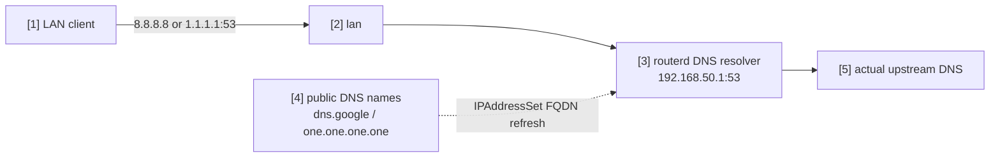

# 將公共 DNS 重新導向至本地解析器


當 LAN 用戶端試圖直接將明文 DNS 查詢送往知名公共解析器時，
僅將 TCP/UDP port 53 重新導向至路由器本地解析器的範例。
DoH 及 DoT 的連接埠不受影響。

完整 YAML 位於 `examples/example-local-dns-redirect.yaml`。

## 構成圖



## 圖示對應表

| 編號 | 含義 | 主要資源 |
| --- | --- | --- |
| [1] | 試圖直接查詢公共 DNS 的用戶端。 | external client |
| [2] | prerouting 重新導向規則比對的 LAN 介面。 | `LocalServiceRedirect/lan-local-services.spec.interface` |
| [3] | 接收重新導向後 port 53 流量的本地解析器。 | `DNSResolver/lan-resolver` |
| [4] | 展開至 nftables set 的完整比對 FQDN。 | `IPAddressSet/public-dns` |
| [5] | 本地解析器實際使用的上游解析器。 | `DNSForwarder`, `DNSUpstream` |

## 要點

```yaml
# [4] 將 public DNS 的 exact name 解析到 IPAddressSet。
- apiVersion: net.routerd.net/v1alpha1
  kind: IPAddressSet
  metadata:
    name: public-dns
  spec:
    names:
      - dns.google
      - one.one.one.one
    refreshInterval: 10m

# [2] -> [3] 只將明文 DNS port 53 重新導向到 local resolver。
- apiVersion: firewall.routerd.net/v1alpha1
  kind: LocalServiceRedirect
  metadata:
    name: lan-local-services
  spec:
    interface: lan
    rules:
      - name: public-dns
        protocols: [tcp, udp]
        destinationSetRef: IPAddressSet/public-dns
        destinationPort: 53
        redirectPort: 53
```

`IPAddressSet.spec.names` 為完全比對的 DNS 名稱。
`dns.google` 不包含子網域。請明確列舉所有需要的目的地名稱。

## 確認

```bash
routerctl validate --config examples/example-local-dns-redirect.yaml
routerctl apply --config examples/example-local-dns-redirect.yaml --dry-run
routerctl describe IPAddressSet/public-dns
nft list table ip routerd_nat
```

從 LAN 用戶端可透過以下方式確認：

```bash
dig @8.8.8.8 router.home.example
dig @1.1.1.1 router.home.example
```
