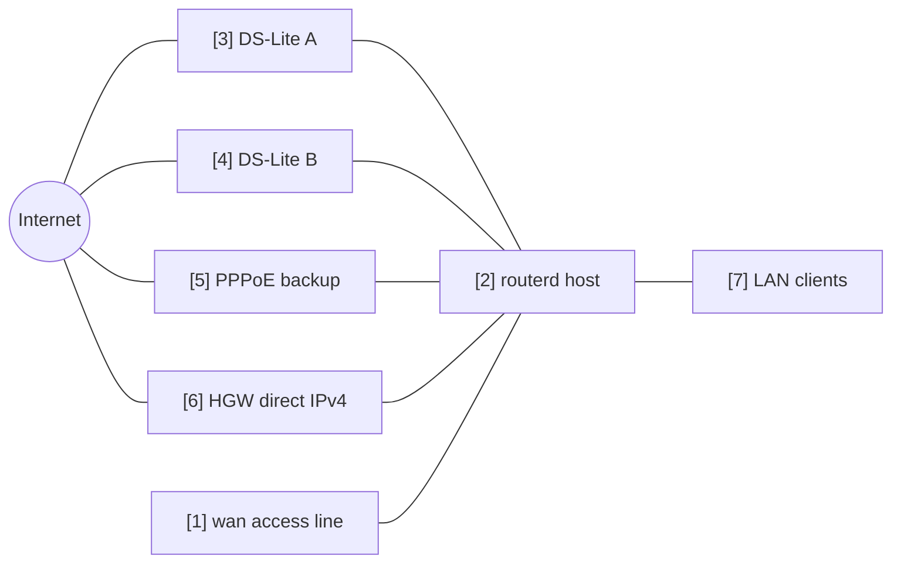

# Multi-WAN IPv4 Failover

從多個 IPv4 出口中選出正常預設路由的範例。
以 DS-Lite 通道、PPPoE 及上游路由器直連的 IPv4 作為候選出口。

完整 YAML 位於 `examples/multi-wan-home.yaml`。

## 構成圖



## 圖示對應表

| 編號 | 含義 | 主要資源 |
| --- | --- | --- |
| [1] | 多個 WAN 候選共用的實體 access line。 | `Interface/wan`, `DHCPv4Client/wan-dhcpv4` |
| [2] | 從中選出單一預設路由的路由器。 | `EgressRoutePolicy/ipv4-default`, `IPv4Route/default` |
| [3] | 第一優先的 DS-Lite。 | `DSLiteTunnel/ds-lite-a`, `HealthCheck/internet-via-dslite-a` |
| [4] | 額外的 DS-Lite 候選。 | `DSLiteTunnel/ds-lite-b`, `HealthCheck/internet-via-dslite-b` |
| [5] | 優先度較低的 PPPoE 備援。 | `PPPoESession/pppoe-flets`, `HealthCheck/internet-via-pppoe` |
| [6] | 上游路由器直連的 IPv4 最終備援。 | `DHCPv4Client/wan-dhcpv4`, `HealthCheck/internet-via-hgw-direct` |
| [7] | 透過 NAT 使用所選 egress 路由的 LAN 用戶端。 | `NAT44Rule/lan-to-selected-wan` |

## 要點

```yaml
# [2] 在目前 healthy 的 candidate 中，選擇 weight 最高的。
- kind: EgressRoutePolicy
  metadata:
    name: ipv4-default
  spec:
    family: ipv4
    destinationCIDRs:
      - 0.0.0.0/0
    selection: highest-weight-ready
    hysteresis: 30s
    candidates:
      # [3] 主要的 DS-Lite candidate。
      - name: ds-lite-a
        weight: 120
        healthCheck: internet-via-dslite-a
      # [5] PPPoE backup 設為較低的 weight。
      - name: pppoe-flets
        weight: 60
        healthCheck: internet-via-pppoe
      # [6] 此範例中將 HGW direct 作為最後的 fallback。
      - name: hgw-direct
        weight: 40
        healthCheck: internet-via-hgw-direct
```

## 確認

```bash
routerd validate --config examples/multi-wan-home.yaml
routerd apply --config examples/multi-wan-home.yaml --once --dry-run
routerctl describe EgressRoutePolicy/ipv4-default
routerctl describe IPv4Route/default
ip route show default
```

## 運用注意事項

- 健康檢查請保守設定。interval 過短會導致品質較弱的線路出現震盪。
- 設定 `hysteresis`，避免僅因暫時性失敗就切換出口。
- RFC1918 目的地，除非有特別意圖，否則應從 NAT 與路由策略中排除。
