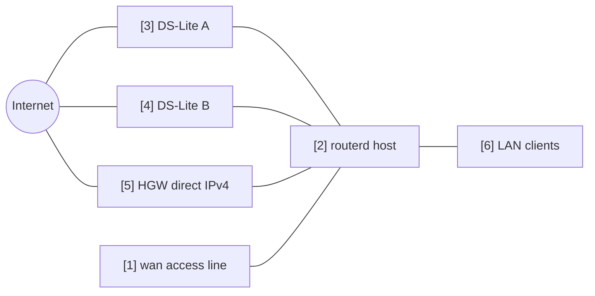

# Multi-WAN IPv4 容錯切換


此範例從兩個 DS-Lite tunnel 與 direct upstream-router IPv4 fallback 選出目前使用的
IPv4 default route。完整 YAML 在 `examples/multi-wan-home.yaml`。**此 YAML 不包含 PPPoE。**

## 架構


```mermaid
flowchart LR
  internet((Internet))
  wan["[1] wan access line"]
  router["[2] routerd host"]
  dsa["[3] DS-Lite A"]
  dsb["[4] DS-Lite B"]
  hgw["[5] HGW direct IPv4"]
  lan["[6] LAN clients"]

  internet --- dsa --- router
  internet --- dsb --- router
  internet --- hgw --- router
  wan --- router --- lan
```

| 編號 | 角色 | 實際資源 |
| --- | --- | --- |
| [1] | 所有 WAN 候選共用的實體線路 | `Interface/wan`、`DHCPv4Client/wan-dhcpv4` |
| [2] | 選擇 default route | `EgressRoutePolicy/ipv4-default` |
| [3] | 第一個 DS-Lite 候選 | `DSLiteTunnel/ds-lite-a`、`HealthCheck/internet-a` |
| [4] | 第二個 DS-Lite 候選 | `DSLiteTunnel/ds-lite-b`、`HealthCheck/internet-b` |
| [5] | 上游路由器直連的最後 IPv4 fallback | `DHCPv4Client/wan-dhcpv4` |
| [6] | 經由 NAT 使用選定出口的 LAN | `NAT44Rule/lan-to-selected-wan` |

## 選擇方式

選擇 `weight`（優先順序數字）較大且 health check 成功的候選。YAML 的實際形狀如下：

```yaml
- kind: EgressRoutePolicy
  metadata:
    name: ipv4-default
  spec:
    family: ipv4
    destinationCIDRs: [0.0.0.0/0]
    selection: highest-weight-ready
    candidates:
      - name: ds-lite-a
        deviceFrom:
          resource: DSLiteTunnel/ds-lite-a
          field: device
        gatewaySource: none
        weight: 100
        healthCheck: internet-a
      - name: ds-lite-b
        deviceFrom:
          resource: DSLiteTunnel/ds-lite-b
          field: device
        gatewaySource: none
        weight: 80
        healthCheck: internet-b
      - name: hgw-direct
        deviceFrom:
          resource: Interface/wan
          field: ifname
        gatewaySource: dhcpv4
        gatewayFrom:
          resource: DHCPv4Client/wan-dhcpv4
          field: gateway
        weight: 40
```

此範例未設定 `hysteresis`。只有觀察到實際線路頻繁切換且確有必要時，才依目前 API
說明考慮加入它。

## daemon 啟動前檢查

```sh
LAB_DIR="$(mktemp -d)"
sudo routerd validate --config examples/multi-wan-home.yaml
sudo routerd apply --config examples/multi-wan-home.yaml --once --dry-run --skip-service-manager \
  --state-file "$LAB_DIR/state.db" \
  --ledger-file "$LAB_DIR/ledger.db" \
  --status-file "$LAB_DIR/status.json"
rm -rf "$LAB_DIR"
```

在 dry-run 中確認 `ens18`、LAN `172.18.0.0/16` 與 DS-Lite 候選名稱符合你的實驗環境。
若與平常的管理網路重疊，不要執行 live 操作。

## 服務啟動後檢查

首次安裝請以可使用 `sudo` 的使用者執行下列指令。若管理員透過 `routerd` 群組授予本機 socket 存取權，加入後必須重新登入才會生效；主機路由檢查仍應保留 `sudo`。

```sh
sudo routerctl describe EgressRoutePolicy/ipv4-default
sudo ip route show default
```

本例不宣告 `IPv4Route/default`。`EgressRoutePolicy` controller 會導出選定的 default
route，因此查看 policy 的 status 與 OS 路由表。

## 操作注意事項

- health check 間隔過短可能使品質較弱的線路反覆切換。
- 除非有明確意圖，否則將 RFC1918 目的地排除在 NAT 與路由策略外。
- 第一次請保留主控台或獨立管理 NIC。
