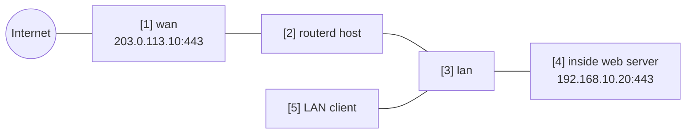

# 內部 Web 伺服器的連接埠轉送


透過 WAN 側 IPv4 位址公開內部 HTTPS 伺服器，
並啟用 hairpin 讓 LAN 用戶端也能以相同公開名稱存取的範例。

完整 YAML 位於 `examples/example-port-forward-web.yaml`。

## 構成圖



## 圖示對應表

| 編號 | 含義 | 主要資源 |
| --- | --- | --- |
| [1] | 外部用戶端連線的公開位址與連接埠。 | `PortForward/web-https.spec.listen` |
| [2] | 產生（render） ingress DNAT 與 hairpin 規則的路由器。 | `PortForward/web-https` |
| [3] | hairpin 流量進入的 LAN 介面。 | `PortForward/web-https.spec.hairpin.interfaces` |
| [4] | DNAT 目的地的內部 HTTPS backend。 | `PortForward/web-https.spec.target` |
| [5] | 使用公開位址或公開 DNS 名稱的 LAN 用戶端。 | hairpin path |

## 要點

```yaml
# [1] 對外 listener。hairpin 時這裡需要具體的 address。
- apiVersion: firewall.routerd.net/v1alpha1
  kind: PortForward
  metadata:
    name: web-https
  spec:
    listen:
      interface: wan
      address: 203.0.113.10
      protocol: tcp
      port: 443
    # [4] 接收經 DNAT 的 connection 的內部 backend。
    target:
      address: 192.168.10.20
      port: 443
    # [3] 讓 LAN client 也能使用相同的對外 address。
    hairpin:
      enabled: true
      interfaces:
        - lan
```

使用 hairpin 時，需要從 LAN 側可見的公開目的地位址。
因此請指定 `listen.address` 或 `listen.addressFrom`。

## 確認

```bash
routerctl validate -f examples/example-port-forward-web.yaml --replace
routerctl plan -f examples/example-port-forward-web.yaml --replace
routerctl describe PortForward/web-https
nft list table ip routerd_nat
```

## 常見調整項目

- 將 `203.0.113.10` 改為實際的 WAN 側 IPv4 位址。
- DNS 請另行設定，使公開名稱解析至此位址。
- 公開的連接埠請控制在必要最小限度。
