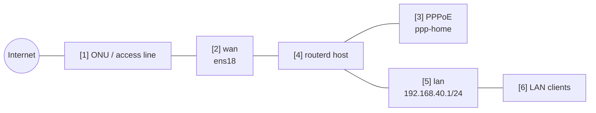

# PPPoE IPv4 NAT 路由器


實體 WAN 使用 Ethernet，透過 PPPoE 連線建立 IPv4 網際網路出口的範例。

完整 YAML 位於 `examples/example-pppoe-ipv4-nat.yaml`。

## 構成圖



## 圖示對應表

| 編號 | 含義 | 主要資源 |
| --- | --- | --- |
| [1] | routerd 管理範圍之外的 access line / ONU。 | routerd 管理外 |
| [2] | 承載 PPPoE 的實體 Ethernet 介面。 | `Interface/wan` |
| [3] | PPPoE 連線與邏輯 egress 介面。 | `PPPoESession/pppoe-home` |
| [4] | 導出 IPv4 forwarding 並套用 nftables NAT 的主機。 | Derived host runtime, `NAT44Rule/lan-to-pppoe` |
| [5] | LAN 閘道與 DHCPv4 區段。 | `IPv4StaticAddress/lan-base`, `DHCPv4Server/lan-dhcpv4` |
| [6] | 透過 NAT 使用 PPPoE 作為 IPv4 網際網路路由的用戶端。 | `DHCPv4Server/lan-dhcpv4` |

## 本範例管理的項目

| 領域 | routerd 資源 |
| --- | --- |
| PPPoE 連線 | `PPPoESession/pppoe-home` |
| LAN 位址 / DHCPv4 | `IPv4StaticAddress/lan-base`, `DHCPv4Server/lan-dhcpv4` |
| IPv4 網際網路連線 | `NAT44Rule/lan-to-pppoe` |
| 過濾 | `FirewallZone/*`, `FirewallPolicy/home` |

## 要點

```yaml
# [3] 在實體 WAN 上建立的邏輯 PPPoE interface。
- kind: PPPoESession
  metadata:
    name: pppoe-home
  spec:
    interface: wan
    ifname: ppp-home
    username: user@example.jp
    passwordFile: /usr/local/etc/routerd/secrets/pppoe-home.password
    mtu: 1454
    mru: 1454
    defaultRoute: true

# [5] -> [3] 將 LAN IPv4 traffic masquerade 到 PPPoE session 側。
- kind: NAT44Rule
  metadata:
    name: lan-to-pppoe
  spec:
    type: masquerade
    egressInterface: pppoe-home
    sourceRanges:
      - 192.168.40.0/24
```

## 確認

```bash
routerd validate --config examples/example-pppoe-ipv4-nat.yaml
routerd apply --config examples/example-pppoe-ipv4-nat.yaml --once --dry-run
routerctl describe PPPoESession/pppoe-home
ip link show ppp-home
ip route show default
```

## 常見調整項目

- PPPoE 密碼請勿直接寫入 YAML，應放置於參照的 secret 檔案中。
- `mtu` 與 `mru` 請依 ISP 提供的資訊調整。
- 若將 PPPoE 作為備援路由，請設定 `defaultRoute: false`。
