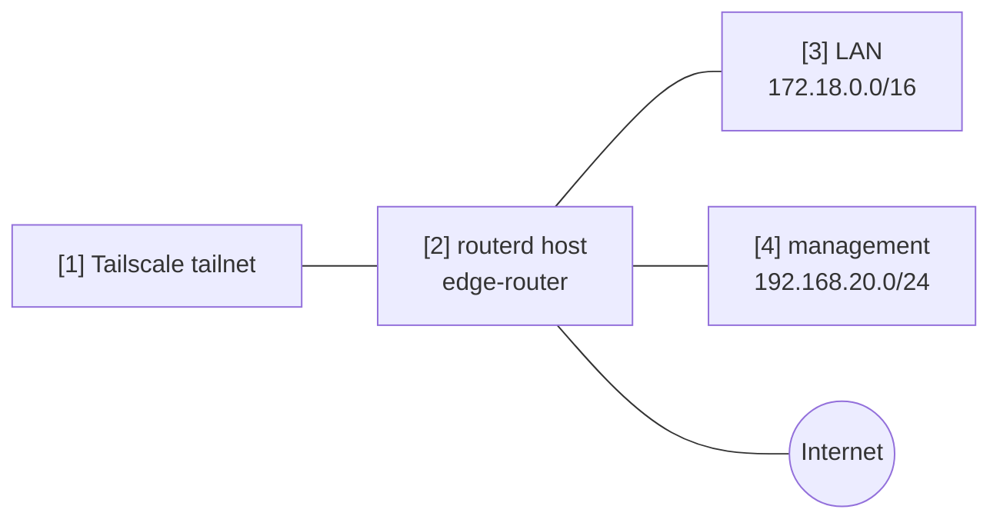

# Tailscale 子網路 / 出口節點


此範例示範如何將路由器同時作為 Tailscale 的 subnet router 和 exit node 進行廣告。

完整的 YAML 位於 `examples/tailscale-exit-subnet.yaml`。

## 架構圖



## 圖示對照表

| 編號 | 說明 | 主要資源 |
| --- | --- | --- |
| [1] | 接收路由與出口節點廣告的 tailnet。 | Tailscale control plane |
| [2] | 以 Tailscale 節點身分註冊的路由器。 | `TailscaleNode/home` |
| [3] | 廣告至 tailnet 的 LAN 前綴。 | `advertiseRoutes` |
| [4] | 廣告至 tailnet 的遠端管理前綴。 | `advertiseRoutes` |

## 重點說明

```yaml
# [2] 將路由器以具名 Tailscale 節點的身分進行註冊。
- apiVersion: net.routerd.net/v1alpha1
  kind: TailscaleNode
  metadata:
    name: home
  spec:
    hostname: edge-router
    advertiseExitNode: true
    # [3] + [4] 廣告至 tailnet 的前綴。
    advertiseRoutes:
      - 172.18.0.0/16
      - 192.168.20.0/24
    acceptDNS: false
    authKeyEnv: TS_AUTHKEY
    authKeyFile: /usr/local/etc/routerd/secrets/tailscale.env
```

## 確認步驟

```bash
routerctl validate -f examples/tailscale-exit-subnet.yaml --replace
routerctl plan -f examples/tailscale-exit-subnet.yaml --replace
routerctl describe TailscaleNode/home
tailscale status
```

請依照 tailnet 的存取政策，在 Tailscale 管理主控台端核准路由與出口節點。
