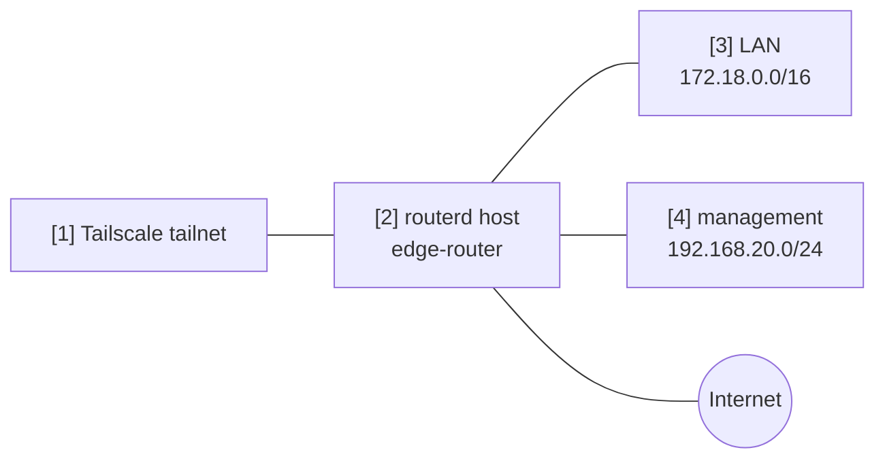

# Tailscale 子網路 / 出口節點


此範例設定已安裝的 Tailscale 用戶端，將路由器同時作為 subnet router 和 exit node
進行廣告。YAML 只有 `TailscaleNode`，並不安裝 Tailscale；請先安裝用戶端並依 tailnet
的註冊流程加入裝置。

完整的 YAML 位於 `examples/tailscale-exit-subnet.yaml`。

## 架構圖


```mermaid
flowchart LR
  tailnet["[1] Tailscale tailnet"]
  router["[2] routerd host<br/>edge-router"]
  lan["[3] LAN<br/>172.18.0.0/16"]
  mgmt["[4] management<br/>192.168.20.0/24"]
  internet((Internet))

  tailnet --- router
  router --- lan
  router --- mgmt
  router --- internet
```

## 圖示對照表

| 編號 | 說明 | 主要資源 |
| --- | --- | --- |
| [1] | 接收路由與出口節點廣告的 tailnet。 | Tailscale control plane |
| [2] | 以 Tailscale 節點身分註冊的路由器。 | `TailscaleNode/home` |
| [3] | 廣告至 tailnet 的 LAN 前綴。 | `advertiseRoutes` |
| [4] | 廣告至 tailnet 的遠端管理前綴。 | `advertiseRoutes` |

## 重點說明

```yaml
# [2] 將路由器以具名 Tailscale 節點的身分進行註冊。
- apiVersion: net.routerd.net/v1alpha1
  kind: TailscaleNode
  metadata:
    name: home
  spec:
    hostname: edge-router
    advertiseExitNode: true
    # [3] + [4] 廣告至 tailnet 的前綴。
    advertiseRoutes:
      - 172.18.0.0/16
      - 192.168.20.0/24
    acceptDNS: false
    authKeyEnv: TS_AUTHKEY
    authKeyFile: /usr/local/etc/routerd/secrets/tailscale.env
```

## 確認步驟

先在 daemon 尚未啟動時進行獨立檢查。下列指令需要具有 `sudo` 權限的本機使用者，但不會套用網路變更。

```bash
LAB_DIR="$(mktemp -d)"
sudo routerd validate --config examples/tailscale-exit-subnet.yaml
sudo routerd apply --config examples/tailscale-exit-subnet.yaml --once --dry-run --skip-service-manager \
  --state-file "$LAB_DIR/state.db" \
  --ledger-file "$LAB_DIR/ledger.db" \
  --status-file "$LAB_DIR/status.json"
rm -rf "$LAB_DIR"
```

服務運行後，才在路由器上執行 `sudo routerctl describe TailscaleNode/home` 與
`sudo tailscale status`。

請依照 tailnet 的存取政策，在 Tailscale 管理主控台端核准路由與出口節點。
