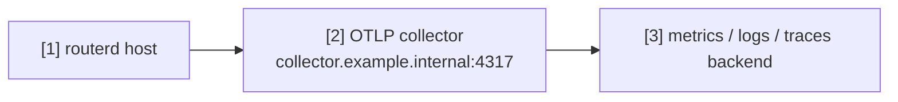

# 將遙測資料傳送至 OTLP 收集器

此範例示範如何將 routerd 的遙測資料傳送至 OpenTelemetry 收集器。
可用於觀測長時間運行狀態、健康檢查、DPI 以及套用操作的延遲。

完整的 YAML 位於 `examples/telemetry-export.yaml`。

## 架構圖



## 圖示對照表

| 編號 | 說明 | 主要資源 |
| --- | --- | --- |
| [1] | 輸出 logs、metrics、traces 的 routerd 程序。 | `Telemetry/otlp` |
| [2] | OTLP 收集器的 endpoint。 | `Telemetry.spec.otlp.endpoint` |
| [3] | 收集器轉送的目標後端。 | routerd 管理範圍外 |

## 重點說明

```yaml
# [1] 啟用 routerd 遙測資料匯出。
- apiVersion: observability.routerd.net/v1alpha1
  kind: Telemetry
  metadata:
    name: otlp
  spec:
    # [2] OTLP collector 端點。
    otlp:
      endpoint: http://collector.example.internal:4317
      insecure: true
    serviceNamespace: routerd
    attributes:
      deployment.environment: lab
      site: example
    signals:
      - logs
      - metrics
      - traces
```

## 確認步驟

```bash
routerd validate --config examples/telemetry-export.yaml
routerctl describe Telemetry/otlp
```

請確認收集器及後端端均已正確接收資料。
endpoint 應置於可信任的管理網路或專用觀測網路中。
