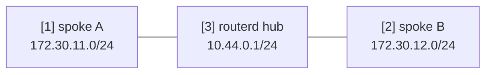

# WireGuard Hub & Spoke 範本


此為具備兩個 spoke 的 routed WireGuard hub 範本。
實際使用前，請替換金鑰、endpoint 及要廣告的前綴。

完整的 YAML 位於 `examples/wireguard-hub-spoke.yaml`。

## 架構圖



## 圖示對照表

| 編號 | 說明 | 主要資源 |
| --- | --- | --- |
| [1] | spoke A 的 tunnel 位址與 routed LAN 前綴。 | `WireGuardPeer/spoke-a` |
| [2] | spoke B 的 tunnel 位址與 routed LAN 前綴。 | `WireGuardPeer/spoke-b` |
| [3] | hub 端的 WireGuard 介面與位址。 | `WireGuardInterface/wg-hub`, `IPv4StaticAddress/wg-hub-ipv4` |

## 重點說明

```yaml
# [3] hub 端 WireGuard 介面與監聽埠。
- kind: WireGuardInterface
  metadata:
    name: wg-hub
  spec:
    privateKeyFile: /usr/local/etc/routerd/secrets/wg-hub.key
    listenPort: 51820
    mtu: 1420

# [1] spoke A 的 tunnel 位址與 routed LAN 前綴。
- kind: WireGuardPeer
  metadata:
    name: spoke-a
  spec:
    interface: wg-hub
    publicKey: REPLACE_WITH_SPOKE_A_PUBLIC_KEY
    allowedIPs:
      - 10.44.0.11/32
      - 172.30.11.0/24
```

## 確認步驟

```bash
routerd validate --config examples/wireguard-hub-spoke.yaml
routerd apply --config examples/wireguard-hub-spoke.yaml --once --dry-run
routerctl describe WireGuardInterface/wg-hub
wg show
```

## 常見調整項目

- 私鑰請存放於限制存取權限的檔案中。
- 每個 peer 須明確指定 tunnel 位址 `/32` 與 routed LAN 前綴。
- 若使用 routerd 管理 WAN 端防火牆，請一併新增 UDP 監聽埠的放行規則。
