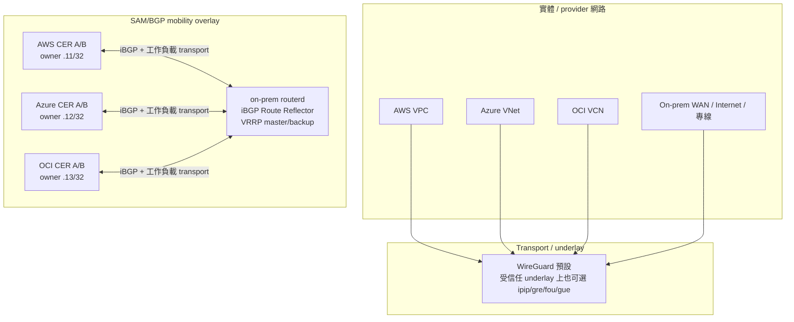
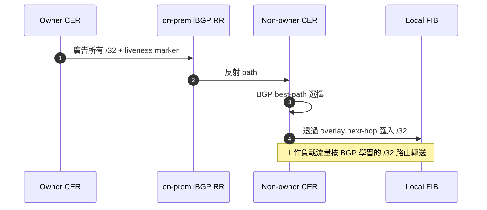
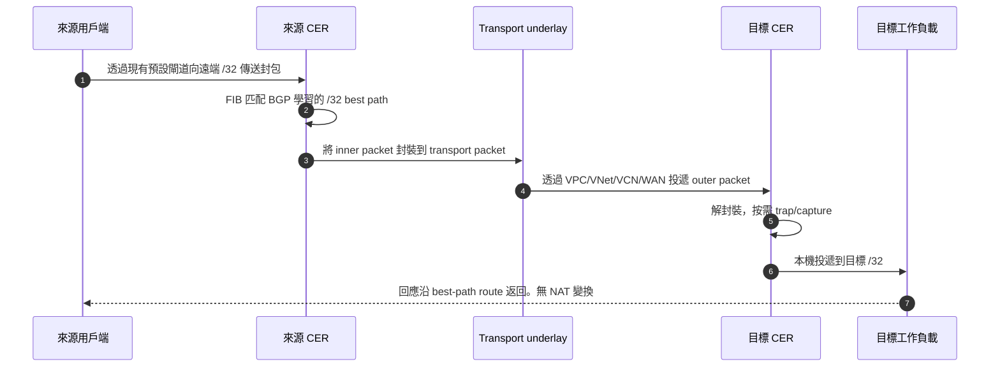
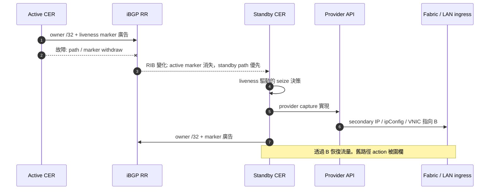
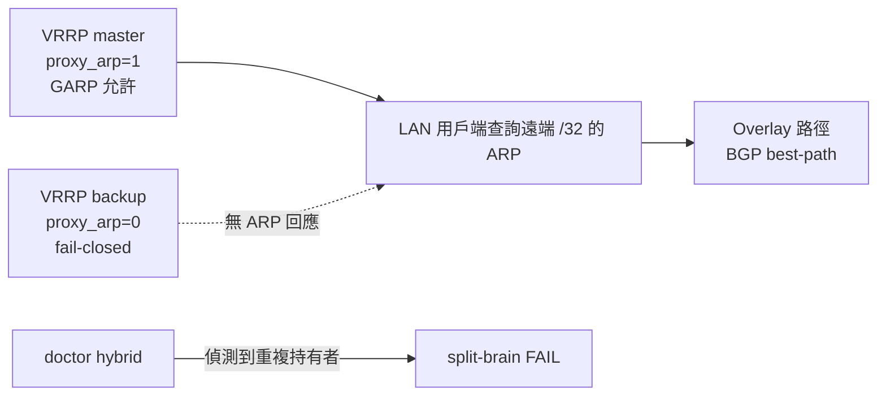

# CloudEdge Selective Address Mobility Phase G — 詳細實作指南


本指南補充 Phase G 的概覽，涵蓋運維人員在解釋和排查 CloudEdge SAM 時
需要的低層細節。

- underlay / transport / overlay 的術語梳理
- WireGuard 或 `TunnelInterface` 的封裝與實際 inner/outer 封包檢視
- iBGP peer、Route Reflector 動作、BGP `/32` 所有權、liveness marker
- RIB 驅動的 trap 與 provider/on-prem capture 實現
- AWS / Azure / OCI / on-prem 的實作差異
- 常規資料平面流程、故障切換、端點的新增和刪除動作

目前 Phase G 設計是 **clean Option B**。BGP 是 mobility 的唯一真實源。
之前的 mobility 專有 `AddressLease`、`ownershipEpoch`、`captureEpoch`、heartbeat、
route-lowering planner 狀態已從主線刪除。這些可能仍留在歷史 ADR 或 Phase G
之前的討論中，但不是描述目前 CloudEdge SAM 的主要路徑。

## 1. 層次術語

CloudEdge 文件中有時將「underlay」用作 SAM/BGP mobility overlay 下層 transport
的簡稱。與運維人員溝通時，區分 3 個層次會很有幫助。

| 層次 | 含義 | CloudEdge SAM 中的例子 |
| --- | --- | --- |
| **實體/provider 網路** | 實際承載 outer packet 的網路。 | AWS VPC、Azure VNet、OCI VCN、on-prem WAN、Internet、DirectConnect、ExpressRoute、FastConnect。 |
| **overlay transport / underlay** | routerd 節點用於在實體/provider 網路上傳輸 BGP 和工作負載封包的隧道或 transport。 | 預設 WireGuard。受信任 underlay 上可用 `TunnelInterface` mode `ipip`、`gre`、`fou`、`gue`。 |
| **SAM/BGP mobility overlay** | 邏輯的 `/32` 可達性平面。 | BGP best-path 所有權、liveness marker route、RIB trap、後台 provider capture。 |
| **工作負載封包** | transport 內部的實際用戶端/服務流量。 | `src=10.77.60.11`、`dst=10.77.60.12`、協定 TCP/UDP/NFS/RPC 等。 |

CloudEdge 文件中說「WireGuard underlay」時，請讀作「SAM/BGP mobility overlay
下層的預設 transport」。不是實體 provider 網路本身。

## 2. 全域拓撲

已驗證的 Phase G 展示使用 4 站點構型。

- on-prem 作為 iBGP Route Reflector hub
- AWS、Azure、OCI 的 Cloud Edge Router 透過 transport 網路與 on-prem RR 建立 peer
- 每個站點有用於本機故障切換的 active/standby 路由器
- 邏輯池內的選定位址（例如 `10.77.60.10/32` 到 `10.77.60.13/32`）作為 BGP `/32` path 廣告和學習



## 3. BGP ownership plane

mobile `/32` 的擁有者是該前綴目前的 BGP best path。
運維人員無需手動記述 lease、claim 或每位址的 provider action。
routerd 將 `MobilityPool` 的意圖投影為 BGP 廣告，觀測 RIB 來判斷本機
應實現什麼。



要點:

- 所擁有的服務/用戶端位址是普通 IPv4 unicast `/32` 廣告
- marker route 表示節點的 liveness，與所有 `/32` 分開
- route policy 和 community 表達優先順序與身分
- BGP RIB/FIB 狀態是資料平面使用的擁有者檢視
- provider capture action 以目前 BGP mobility path signature 圍欄

## 4. 封裝: 實際封包檢視

當某站點向遠端 owner `/32` 傳送流量時，用戶端封包
不做 NAT。它成為 transport 承載的 **inner packet**。

例: AWS 用戶端 `.11` 與 Azure owner `.12` 通訊。

```text
inner 工作負載封包:
  src = 10.77.60.11
  dst = 10.77.60.12
  proto = TCP/22, NFS, RPC, FTP, bulk TCP 等

transport 封裝:
  WireGuard / GRE / IPIP / FOU / GUE 包裹 inner packet。

outer transport 封包:
  src = AWS CER 的 transport/underlay IP
  dst = Azure CER 的 transport/underlay IP
  proto = WireGuard 為 UDP/51820、GRE、IPIP、UDP-encap 等

實體/provider 網路:
  AWS VPC / WAN / Azure VNet 投遞 outer packet。
```

接收端 CER:

1. transport 封包被解封裝。
2. inner packet 仍為 `src=10.77.60.11`、`dst=10.77.60.12`。
3. 目標站點透過 capture 的 `/32` path 本機投遞。
4. 回應流量沿相同 overlay/BGP 決策路徑反向行進。

## 5. 各環境的 capture 實現

BGP 決定可達性。provider 或 on-prem capture 使選定的 `/32`
在正確的邊緣實體或本機可達。

| 環境 | capture 方法 | 控制/API | 故障切換動作 | 注意 |
| --- | --- | --- | --- | --- |
| AWS | ENI secondary private IP | allow-reassignment 動作的 `assign-private-ip-addresses` | active 的 marker/path 消失後 standby 奪取 secondary IP。 | 確保 ENI 權限和 source/dest check 行為一致。 |
| Azure | NIC secondary IP（via ipConfig） | 刪除舊持有者的 ipConfig，建立新持有者的 ipConfig | 2 步 remove/add。重試需處理部分故障。 | IP 持有 NIC 暫時不存在的短視窗。executor 需冪等。 |
| OCI | VNIC secondary private IP | `assign-private-ip --unassign-if-already-assigned` | standby 將 private IP 再配置到自身 VNIC。 | 驗證 VNIC/private-IP 狀態、forwarding 和本機防火牆。 |
| On-prem | proxy ARP + GARP | 由 VRRP/CARP 樣的 mastership 閘門控制的 OS 網路，或對單站點/單路由器/單 owner 的 lab 使用 `capture.activeWhen.type: single-router` | HA 對使用 VRRP master 閘門。單路由器站點可選無 VRRP 的常時 active capture。 | 防止重複 ARP 回應。split-brain doctor 必須大聲失敗。 |

provider secondary IP 的 reconciliation 是後台 fabric-ingress 實現。
對雲原生入口路徑很重要，但不得成為 overlay 可達性的真實源。

## 6. 常規通訊序列



應透過封包擷取證明的不變量:

- 用戶端的預設閘道未變化
- 伺服端能看到原始來源 `/32`
- 不出現 NAT 變換簽章
- 僅選定的 `/32` 目標被 CloudEdge SAM 吸收
- bulk/protocol 測試不因 MTU/PMTU 產生黑洞

## 7. 雲端故障切換序列



各 provider 動作:

- AWS: 將 secondary private IP 再配置到 standby ENI。
- Azure: 刪除舊 ipConfig，在 standby NIC 建立新 ipConfig。
- OCI: `--unassign-if-already-assigned` 將 private IP 再配置到 standby VNIC。
- On-prem: VRRP master 轉換使僅新 master 啟用 proxy ARP/GARP。

## 8. On-prem 的 LAN capture 與 split-brain 安全性

BGP 能決定遠端 overlay 路徑，但僅靠它不能保護本機 L2 ARP 權限。
因此 on-prem capture 在本機閘門控制。



規則:

- 僅 master 對 capture 的 `/32` 位址以 proxy ARP 回應
- backup 即使持有相同的宣告式意圖也保持 fail-closed
- master 轉換時傳送 GARP 以重新整理 LAN 快取
- 單站點/單路由器/單 owner 構型中，`capture.activeWhen.type: single-router` 是無 VRRP 閘門的顯式常時 active proxy-ARP capture 模式
- 重複 proxy ARP 持有者是硬性診斷失敗

## 9. 端點的新增/刪除與路由傳播

關鍵訊息傳播是 BGP 的 advertise/withdraw，而非 mobility 專有的
lease/heartbeat 傳播。

### 新增或恢復的 `/32`

1. 本機 owner 變為 eligible，廣告所有 `/32` 和 marker。
2. RR 將路由反射到雲端/on-prem peer。
3. peer 將 best path 匯入本機 FIB。
4. RIB trap 按需觸發 provider/on-prem capture reconciliation。
5. 資料平面開始向新 owner path 轉送。

### 刪除或移動的 `/32`

1. 舊 owner withdraw `/32` 或 marker 消失。
2. BGP best path 變化或消失。
3. path-signature fencing 使 stale provider action 被跳過。
4. 新持有者廣告並實現 capture。
5. 所有 peer 收斂到新 FIB 路由或釋放狀態。

## 10. PMTU 與協定透明性

封裝增加了開銷。因此 CloudEdge 將 PMTU/MSS 視為
資料平面不變量，而非可選診斷項。

- `EstimateMTU` 跟隨 WireGuard 或 `TunnelInterface` 的開銷。
- `routerd_mss` 鉗制 TCP MSS 以避免黑洞。
- 受信任路徑上，當 DF 黑洞緩解比保持 DF 語意更重要時，可用 IPv4 force-fragment。
- 協定透明性 acceptance 應包含 ping 之外的 FTP active/passive、NFS、RPC/rpcbind、大容量 TCP bulk、DF/no-DF PMTU 探測。

## 11. 運維檢查清單

解釋或除錯 CloudEdge SAM 時，按此清單依次確認。

1. 目前 BGP best path owner 持有哪些 `/32`？
2. 承載 iBGP 工作階段和工作負載封包的 transport 是什麼？
3. 能否分別觀測 inner 和 outer 封包？
4. non-owner CER 是否將 `/32` 的 best path 匯入了 FIB？
5. provider/on-prem capture 是否以正確權限執行？
6. stale provider action 是否被目前 BGP path signature 圍欄？
7. on-prem backup 是否 fail-closed，split-brain doctor 是否乾淨？
8. 封包擷取是否證明了 source 保持和 NAT 無？
9. MSS/PMTU 探測和 bulk 協定是否通過？

## 12. 面向人類的簡短說明

CloudEdge SAM 是 BGP best-path 驅動的 `/32` mobility。routerd 以 WireGuard 等
transport underlay 連接站點，透過 iBGP 學習和廣告選定 `/32` 的 owner，
trap RIB 變化，以 provider secondary IP 或 on-prem proxy ARP/GARP 實現 ingress，
以 NAT 無方式傳輸工作負載封包，因此來源 IP 和用戶端的
預設閘道行為不變。
