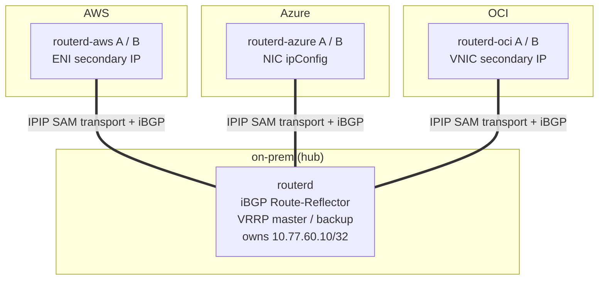
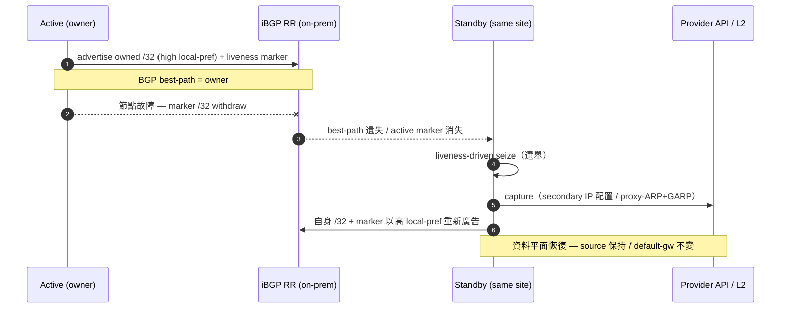
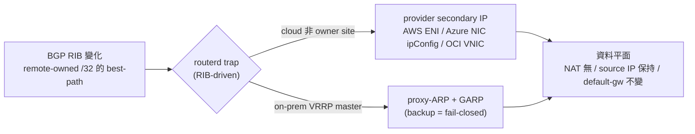
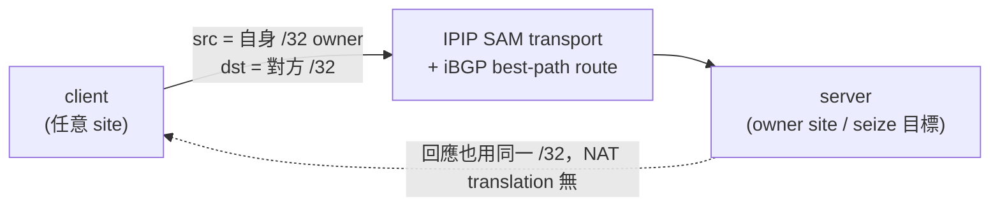
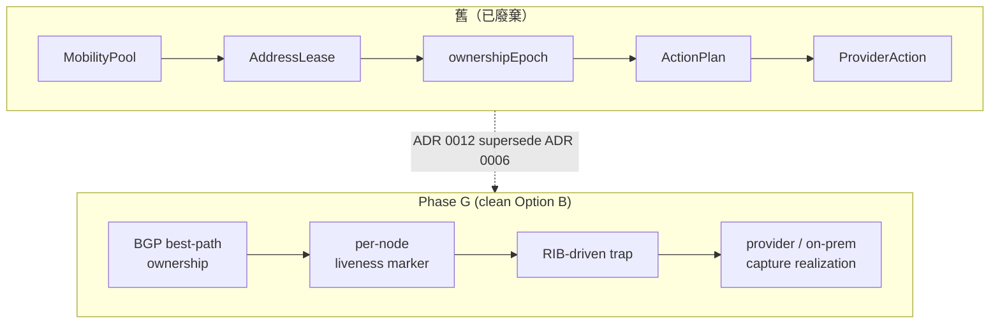

# CloudEdge Selective Address Mobility (Phase G) — 說明圖

CloudEdge SAM Phase G 跨 AWS / Azure / OCI / on-prem 使選定的 `/32`
服務/用戶端位址以 **NAT 無、source IP 保持、default gateway 不變**的方式
可達，並在路由器節點故障時由同一站點的 standby 自主取得所有權，
恢復 L3 可達性。

設計的核心是 **clean Option B**:

- **ownership = BGP best-path** — `/32` 的擁有者由 BGP 最佳路徑決定（無中央鎖或
  lease/epoch 的單一真實源）。
- **liveness = per-node marker** — 每個節點廣告 overlay `/32` + identity community 的
  marker。active marker 消失即觸發 failover。
- **trap = RIB-driven** — RIB 變化（remote-owned `/32` 的 best-path）由 routerd trap。
- **seize = liveness-driven** — active marker 消失後同一站點的 standby seize。

---

## 1. 拓撲 — SAM transport + iBGP hub-spoke

每個站點的 routerd 在 `SAMTransportProfile` 產生的 IPIP transport 上建立 iBGP，
以 on-prem Route-Reflector(RR) 為 hub 的 hub-spoke 構型。需要加密的環境中
WireGuard 作為 endpoint 專用 underlay 鋪設在下方。

- 邏輯 `/24` = `10.77.60.0/24`。每個站點的 owner `/32`（例如 on-prem `.10` / AWS `.11`
  / Azure `.12` / OCI `.13`）從所有站點均可達。
- 預設投遞為 IPIP。使用 WireGuard 時 `AllowedIPs` 僅限 transport endpoint
  prefix，mobile `/32` 由 BGP 和 FIB 處理。

---

## 2. 所有權與自主故障切換

active 以高 local-pref 廣告所有 `/32` 和 liveness marker。節點故障導致 marker
withdraw 後，同一站點的 standby **零手動操作**seize。

實測收斂時間（acceptance）: AWS 16.9s / Azure 56.7s / OCI seize / **on-prem VRRP 8s**，
全部 `manualProviderAction=false`（自主）。目標 60s 以下。

---

## 3. capture 的實現 — 從 trap 到各 provider / on-prem

trap RIB 的 best-path 變化，雲端透過 provider secondary IP，on-prem 透過
VRRP-master gated 的 proxy-ARP + GARP 捕獲 `/32`。

- on-prem 是 **VRRP-master hard-gate**: 僅 master 對 proxy-ARP/GARP 做出回應，backup
  fail-closed（`proxy_arp=0`，不回應 ARP）。`routerctl doctor hybrid` 對 split-brain
  確定性 FAIL（設計上無迴圈）。
- cloud capture 的 provider mutation 以最小權限 identity（AWS ENI-scoped / OCI compartment /
  Azure custom role）自主執行。

---

## 4. 資料平面不變量

- **NAT 無** — 不出現 translation 簽章（tcpdump 確認）。
- **source IP 保持** — server 看到的 source 是 client 的 `/32`。
- **default gateway 不變** — client 的預設路由不改變。
- **MTU/PMTU** — 跟隨 overlay 有效 MTU 做 MSS clamp(`routerd_mss`)，必要時
  IPv4 force-fragment(P2-b, ADR 0013, 預設關閉)迴避 DF blackhole。
- 透明性 acceptance: FTP(active/passive) / NFS / RPC(rpcbind) / 100MB bulk
  無 fragment/blackhole 完走（source 保持、no-NAT 確認）。

---

## 5. 與舊模型的對比

撤除了多個真實源（lease / epoch / heartbeat / action journal）交織的複雜度，
**BGP 作為唯一的 ownership plane**，使網路解釋更簡明、更健壯。

---

## 相關

- ADR 0012: BGP /32 Address Mobility（clean Option B）
- ADR 0009: Pluggable Overlay Underlay（ipip/gre/fou/gue）
- ADR 0013: IPv4 Force Fragmentation
- reference: Selective Address Mobility
- how-to: cloudedge-mobility-demo / cloudedge-autonomous-lab
- 投影片: `docs/slides/cloudedge-sam-phase-g.md`
