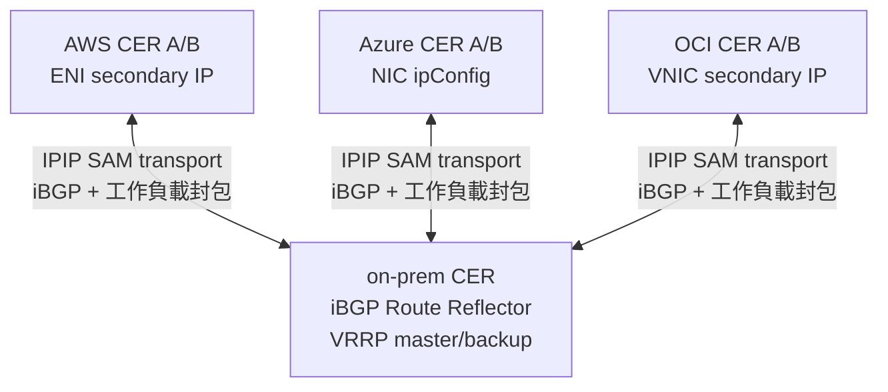
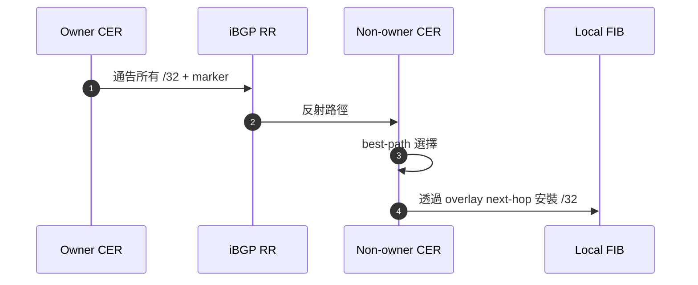
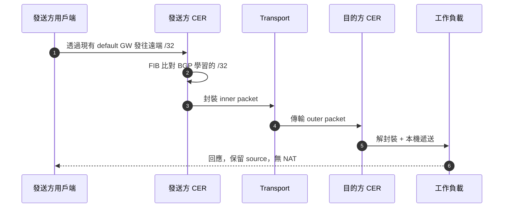
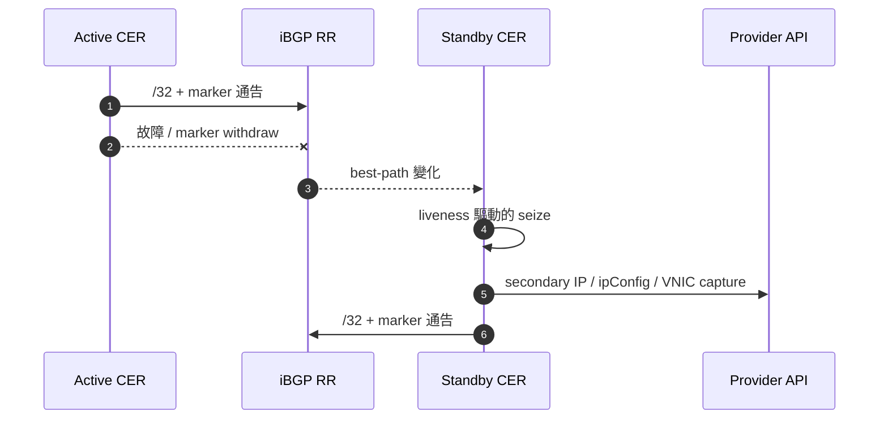
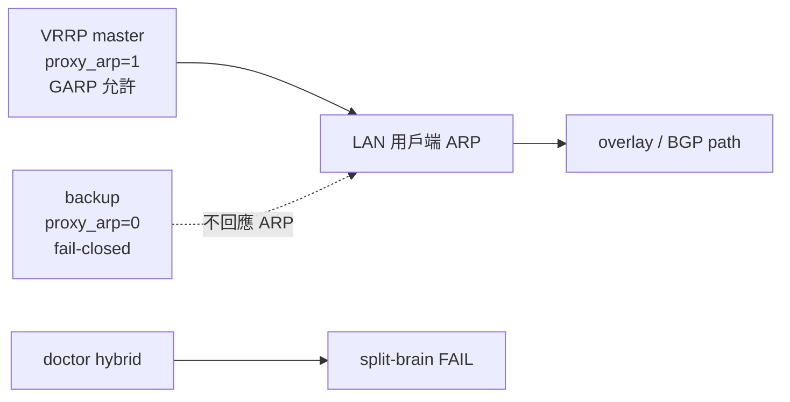

# CloudEdge SAM Phase G 詳細解析
## underlay / transport / overlay / BGP / 封包 / secondary IP

跨 AWS / Azure / OCI / on-prem 的 BGP best-path 驅動的 `/32` mobility

**無 NAT / 保留來源 IP / default gateway 不變**

---

## 1. 對齊各層

| 層 | 角色 | 範例 |
|---|---|---|
| physical/provider network | 實際傳輸 outer packet | AWS VPC / Azure VNet / OCI VCN / WAN / Internet |
| transport / underlay | 承載 SAM/BGP overlay 的底層 | IPIP/GRE tunnel，需要時使用 endpoint-only WireGuard underlay |
| SAM/BGP mobility overlay | 決定 `/32` owner 和 delivery | BGP best-path / marker / RIB trap |
| workload packet | 終端和服務的實際通訊 | src/dst 保持 `/32` 不變 |

> CloudEdge 文件中所稱的 "underlay"，有時指從 SAM overlay 視角看的底層 transport。

---

## 2. 4 站點拓撲



- logical pool：`10.77.60.0/24`
- 選定 owner：`.10` on-prem、`.11` AWS、`.12` Azure、`.13` OCI
- 非完全 L2 extension，而是透過 BGP 使選定的 `/32` 可達

---

## 3. BGP ownership plane

| 要素 | 方式 |
|---|---|
| ownership | BGP best-path |
| liveness | per-node marker route + identity community |
| delivery | 透過 BGP 學習的 `/32` FIB route |
| trap | RIB 驅動的 best-path 變化 |
| provider capture | 從 BGP path view 進行的背景 reconciliation |

`AddressLease / ownershipEpoch / captureEpoch / heartbeat` 已從主線移除，
BGP RIB 成為 mobility 的唯一真實來源。

---

## 4. BGP 路徑傳播



需要確認的內容：

- GoBGP RIB / Adj-RIB-Out
- route policy / local-pref / community
- marker path 的存在
- OS FIB 中的 `/32` route

---

## 5. 封裝：inner 與 outer

```text
inner 工作負載封包：
  src = 10.77.60.11
  dst = 10.77.60.12

transport：
  IPIP / GRE TunnelInterface
  端點加密可選用 WireGuard underlay

outer 封包：
  src = 發送方 CER 的 transport IP
  dst = 目的方 CER 的 transport IP
```

要點：

- inner 的 src/dst 不做 NAT
- 只有 outer packet 在 physical/provider network 上傳輸
- tcpdump 需區分 inner/outer 的觀測點

---

## 6. capture 實現

| 環境 | capture | API / 實作 | failover |
|---|---|---|---|
| AWS | ENI secondary private IP | assign-private-ip-addresses | allow-reassignment |
| Azure | NIC ipConfig secondary IP | 刪除舊 ipConfig + 新建 | 2 步重試 |
| OCI | VNIC secondary private IP | assign-private-ip | unassign-if-already-assigned |
| on-prem | proxy ARP / GARP | OS networking + VRRP 閘控 | 僅 master，backup 為 fail-closed |

BGP best-path 決定 owner。secondary IP / ARP 實現 ingress。
單一 on-prem 路由器配置下，可透過 `capture.activeWhen.type: single-router` 選擇無 VRRP 的常時 capture。

---

## 7. 正常封包流



---

## 8. 雲端故障切換序列



- stale 的路徑 action 使用當前 BGP path signature 進行 fencing
- overlay 可達性可在 provider fabric 追趕完成前恢復

---

## 9. On-prem VRRP / proxy ARP 的安全性



- BGP 不取代本機 L2/ARP 權限
- 僅 master 實現 proxy ARP / GARP
- backup 保持 fail-closed
- single-router capture 是面向 1 站點 / 1 路由器 / 1 owner 的明確模式
- 重複 proxy-ARP 持有者是診斷故障

---

## 10. 端點的新增與移除

### 新增 `/32`
1. owner 通告 `/32` + marker
2. RR 反射路徑
3. non-owner 匯入 FIB route
4. RIB trap 觸發 capture reconciliation
5. 開始轉發流量

### 刪除或移動的 `/32`
1. 舊 owner withdraw 路徑或 marker 消失
2. best path 變化
3. stale 的 provider action 被略過
4. 新持有者通告並 capture
5. 對等方收斂

---

## 11. PMTU 與協定透通性

- 封裝額外開銷會改變實際 MTU
- `routerd_mss` 透過 TCP MSS clamp 避免黑洞
- IPv4 force-fragment 用於可信路徑，預設關閉
- acceptance 應包含的項目：
  - FTP active/passive
  - NFS
  - RPC / rpcbind
  - 100MB 批量傳輸
  - DF / no-DF PMTU 探測
  - 透過 tcpdump 確認 source 保留 / 無 NAT

---

## 12. 講解檢核清單

1. 當前 BGP best-path owner 擁有哪些 `/32`？
2. 承載 iBGP 和工作負載封包的 transport 是什麼？
3. 在哪裡可以觀測 inner 和 outer 的封包標頭？
4. 本機 FIB 是否已匯入遠端 `/32`？
5. 實現 ingress 的 provider/on-prem capture 機制是哪個？
6. stale 的 action 是否使用 path signature 進行了 fencing？
7. 封包擷取是否證明了無 NAT 和 source 保留？

CloudEdge SAM = **BGP best-path driven `/32` mobility**。
