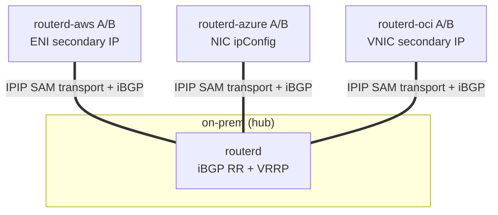
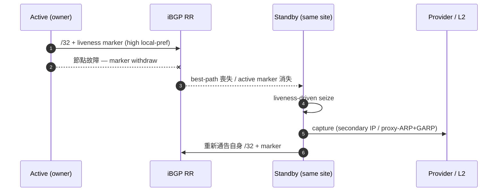
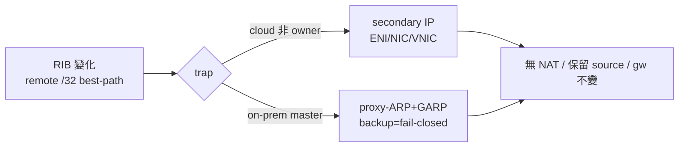

<!--
Marp 投影片。算繪範例：
  npx @marp-team/marp-cli docs/slides/cloudedge-sam-phase-g.md -o cloudedge-sam-phase-g.html
  npx @marp-team/marp-cli docs/slides/cloudedge-sam-phase-g.md --pdf
在 docusaurus 中也可作為一般 Markdown 頁面閱讀（--- 算繪為分隔線）。
-->

# CloudEdge Selective Address Mobility
## Phase G — 自主 BGP `/32` 位址移動性

跨 AWS / Azure / OCI / on-prem 的 `/32` 可攜性
**無 NAT、保留來源 IP、default gateway 不變**

routerd Cloud Edge Router

---

## 課題

- 在多雲 + 本地部署環境中，需要在站點間使同一 `/32`（服務/用戶端位址）可達。
- 路由器節點故障時，需要**零手動操作**由同一站點的 standby 接管，
  恢復 L3 可達性。
- 需要以**統一框架**處理 provider 特定的操作（AWS secondary IP /
  Azure NIC ipConfig / OCI VNIC / on-prem VRRP）。
- 防止 split-brain / flapping，目標收斂時間**低於 60s**。

---

## 設計 — clean Option B

| 要素 | 方式 |
|---|---|
| **ownership** | BGP best-path（唯一真實來源） |
| **liveness** | per-node marker（overlay `/32` + identity community） |
| **trap** | RIB-driven（擷取 best-path 變化） |
| **seize** | liveness-driven（active marker 消失時 standby 取得） |

撤除舊有的 **AddressLease / ownershipEpoch / heartbeat / ActionPlan**。
排除多個真實來源，將 BGP 作為唯一的 ownership plane。

-> ADR 0012 supersede ADR 0006

---

## 拓撲 — SAM transport + iBGP hub-spoke

logical `/24` = `10.77.60.0/24` / 預設 delivery 為 IPIP，需要加密時使用 endpoint-only WireGuard underlay

---

## 自主故障切換

零手動操作、`manualProviderAction=false`

---

## capture 的實現

- on-prem：**VRRP-master 硬閘控** — backup 為 fail-closed（`proxy_arp=0`）
- doctor hybrid 確定性地判定 split-brain 為 FAIL（設計上無迴圈）
- 雲端變更以**最小權限 identity** 自主執行

---

## 資料平面不變條件

- **無 NAT** — 不產生 translation signature
- **保留來源 IP** — 伺服器看到的 source = 用戶端的 `/32`
- **default gateway 不變** — 用戶端的預設路由不變
- **MTU/PMTU** — overlay 追隨的 MSS clamp（`routerd_mss`）+ 選用的 IPv4
  force-fragment（預設關閉）避免 DF blackhole

-> FTP(active/passive) / NFS / RPC / 100MB bulk 無 fragment 完成

---

## transport 與 PMTU

- **SAMTransportProfile**
  - 預設 delivery 為 IPIP `TunnelInterface`
  - WireGuard 為 endpoint `/32` 專用 underlay。mobile `/32` 不加入 `AllowedIPs`
- **P2-b — IPv4 force-fragment**（ADR 0013）
  - `OverlayPeer / TunnelInterface.pathMTU.forceFragmentIPv4`，預設關閉
  - 緩解低 PMTU underlay 的 DF blackhole（僅限 IPv4）

---

## acceptance 結果（實機 evidence）

| 項目 | 結果 |
|---|---|
| overall | **overallPass: true** |
| 4-site matrix | D3 **12/12** |
| AWS / Azure / OCI failover | D5 / D6 56.7s / D7（自主, 60s 以下） |
| on-prem VRRP | D8 recovery **8s**, backup fail-closed, split-brain FAIL |
| L2 loop / STP | recovery 3s, STP blocking, loop-free |
| 協定透通性 | FTP/NFS/RPC/100MB/PMTU/source 保留/no-NAT 全 PASS |
| 最小權限 | AWS / OCI / Azure scoped identity 實證 |
| unit | go test **2322 pass** |

---

## 總結

- **BGP best-path 決定 `/32` 的 owner**
- **CER trap RIB 變化**
- **雲端透過 secondary IP，on-prem 透過 proxy-ARP/GARP 實現**
- **資料平面不做 NAT，維持來源 IP 和 default gateway**

CloudEdge SAM = *BGP best-path driven `/32` mobility*

兼具網路工程師能理解的簡潔性和實機 acceptance 驗證的穩健性。
